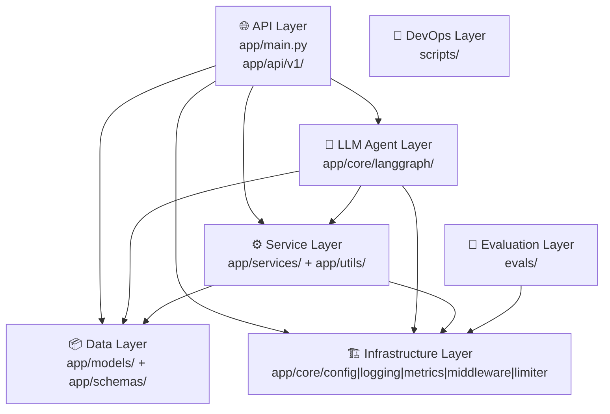

# 代码库知识图谱

> 由 [Understand Anything](https://github.com/anthropics/understand-anything) 生成
> 分析时间：2026-03-24
> Git commit：`c877684`

## 项目概览

**名称：** `langgraph-fastapi-template`

**描述：** 生产级 FastAPI + LangGraph AI Agent 模板，提供 JWT 认证、长期记忆（mem0）、LLM 可观测性（Langfuse）、流式响应、限流保护和模型评估框架。

| 属性 | 值 |
|---|---|
| 语言 | Python、Bash |
| 主要框架 | FastAPI、LangGraph、LangChain、Langfuse、Pydantic、mem0ai |
| 分析文件数 | 41 |
| 节点总数 | 104（文件 41、函数 43、类 20） |
| 边总数 | 184（imports 70、contains 64、exports 49、inherits 1） |

---

## 架构层级



| 层 | 描述 | 文件数 |
|---|---|---|
| **API Layer** | FastAPI 路由处理器与应用入口（main.py、auth、chatbot、api 聚合器） | 4 |
| **LLM Agent Layer** | LangGraph 状态图引擎，含 PostgreSQL checkpoint、mem0 长期记忆、工具注册和提示词模板 | 4 |
| **Service Layer** | 业务逻辑服务（DatabaseService、LLMService）和工具函数（JWT、消息处理、输入清洗） | 7 |
| **Data Layer** | SQLModel ORM 实体（User、Session、Thread）和 Pydantic 请求/响应 Schema | 9 |
| **Infrastructure Layer** | 跨层共享基础设施：配置（fan-in 14）、结构化日志（fan-in 9）、Prometheus 指标、限流器、中间件 | 5 |
| **Evaluation Layer** | 独立的 LLM 质量评估框架，从 Langfuse 拉取 trace 并用 OpenAI 结构化输出打分 | 5 |
| **DevOps Layer** | Docker 生命周期管理脚本（构建/启动/停止/日志/数据库初始化/环境变量） | 7 |

---

## 12 步代码导览

按依赖图的 BFS 顺序，从入口到深层依次理解整个系统：

| 步骤 | 标题 | 涉及文件 |
|---|---|---|
| 1 | **应用入口** | `app/main.py` |
| 2 | **基础设施基础** | `app/core/config.py`、`app/core/logging.py` |
| 3 | **请求管道中间件** | `app/core/middleware.py`、`app/core/limiter.py`、`app/core/metrics.py` |
| 4 | **API 路由聚合** | `app/api/v1/api.py` |
| 5 | **认证路由与工具** | `app/api/v1/auth.py`、`app/utils/auth.py` |
| 6 | **数据模型与 Schema** | `app/models/user.py`、`app/models/session.py`、`app/schemas/auth.py`、`app/schemas/chat.py` |
| 7 | **数据库服务层** | `app/services/database.py`、`app/models/base.py`、`app/models/database.py` |
| 8 | **聊天路由与 Agent 交接** | `app/api/v1/chatbot.py` |
| 9 | **LangGraph Agent 核心** | `app/core/langgraph/graph.py`、`app/utils/graph.py`、`app/schemas/graph.py` |
| 10 | **Agent 工具与提示词** | `app/core/langgraph/tools/__init__.py`、`app/core/langgraph/tools/duckduckgo_search.py`、`app/core/prompts/__init__.py` |
| 11 | **LLM 服务与可观测性** | `app/services/llm.py` |
| 12 | **评估框架** | `evals/main.py`、`evals/evaluator.py`、`evals/helpers.py`、`evals/schemas.py` |

---

## 关键文件速查

| 文件 | 角色 | fan-in |
|---|---|---|
| `app/core/config.py` | 全局配置中心，所有层共享 | 14 |
| `app/core/logging.py` | 结构化日志，请求级上下文绑定 | 9 |
| `app/core/langgraph/graph.py` | LangGraph Agent 主类（LangGraphAgent） | 1（被 chatbot 调用） |
| `app/services/database.py` | 全量 CRUD 服务（DatabaseService） | 3 |
| `app/services/llm.py` | OpenAI 调用封装，含 tenacity 重试 | 2 |
| `app/api/v1/auth.py` | 认证路由（fan-out 最高：16） | 2 |
| `app/main.py` | FastAPI 应用组合根，fan-out 10 | 0（入口） |

---

## 启动交互式 Dashboard

Dashboard 提供节点图、层级视图和逐步导览。

### 方式一：通过 Claude Code（推荐）

在项目目录下运行：

```
/understand-dashboard
```

### 方式二：手动启动

```bash
# 进入 dashboard 目录
cd ~/.claude/plugins/cache/understand-anything/understand-anything/1.1.1/packages/dashboard

# 安装依赖（首次）
pnpm install

# 构建 core 包（首次）
cd .. && pnpm --filter @understand-anything/core build && cd dashboard

# 启动（指向本项目）
GRAPH_DIR=/Users/young/Downloads/repos/Job-Hunter-Agent npx vite --open
```

Dashboard 默认在 **http://localhost:5173** 打开。

### 更新知识图谱

当代码库发生变化后，重新分析：

```
/understand
```

工具会自动检测 git diff，仅对变更文件做增量更新。

---

## 文件说明

```
.understand-anything/
├── knowledge-graph.json   # 知识图谱数据（节点、边、层、导览）
├── meta.json              # 分析元数据（时间戳、git commit）
└── README.md              # 本文档
```
