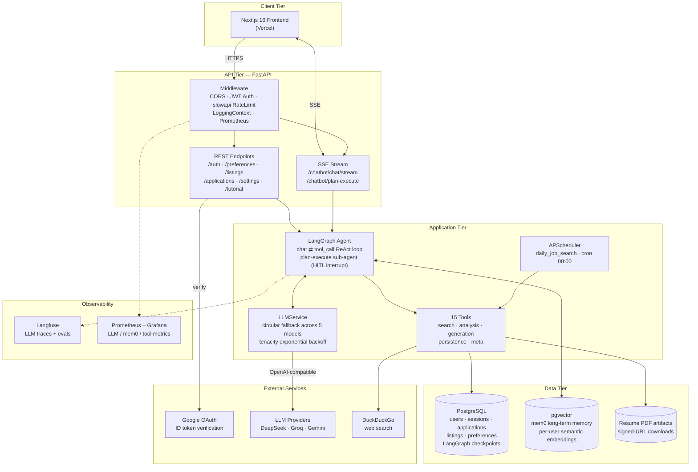
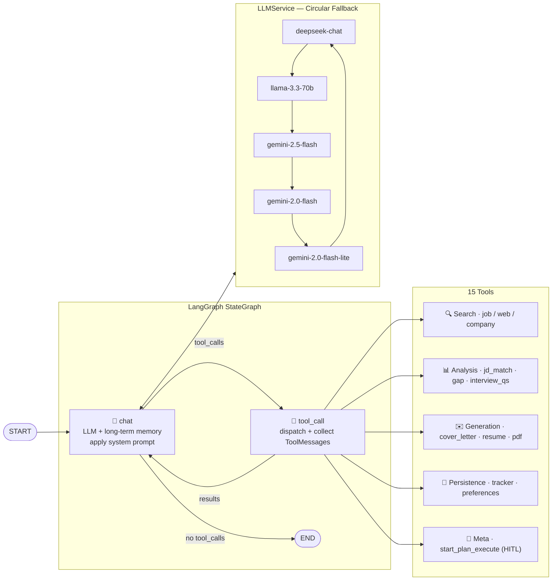

# Job Hunter Agent

> AI-powered job hunting assistant — automates job search, company research, cover letter writing, and application tracking via a LangGraph conversational agent.

---

## Features

| Feature | Description |
|---|---|
| **Job Search** | Search LinkedIn, Indeed, BOSS 直聘, Lagou by keyword + location + job type via DuckDuckGo |
| **Company Research** | Research target company overview, culture (Glassdoor), recent news, and funding |
| **Resume Tailoring + PDF** | LLM-generated tailored resume text + weasyprint PDF export with signed download URLs |
| **JD ↔ Resume Match Scoring** | Score JD/resume match across skills/experience/domain/soft with weighted breakdown |
| **Interview Prep** | Generate interview questions + JD gap analysis based on the tailored resume |
| **Application Tracking (Kanban)** | Drag-and-drop kanban board with 5 states (pending / applied / interviewing / completed / not_a_match), per-card artifacts |
| **Plan & Execute (HITL)** | Agent self-planning with human approval gates — user can approve, revise with feedback, or cancel multi-step plans |
| **Daily Auto-Search** | Save search preferences; APScheduler cron fetches new listings into "Today's Picks" |
| **Long-Term Memory** | Cross-session memory of user skills, experience, and preferences for personalized responses |
| **Custom System Prompt** | Per-user editable system prompt with a modal UI |
| **Streaming Chat** | Real-time SSE streaming with live tool-call cards in the frontend |
| **Onboarding Tour** | First-login UI tour + seeded tutorial session with default resume (bilingual zh-CN / en) |
| **Google OAuth** | Single-click login via Google ID token verification |

---

## 🚀 Tech Stack

| Module | Tech Stack |
|---|---|
| **Backend** |    |
| **Frontend** |     |
| **AI Orchestration** |    |
| **LLM Models** |    |
| **Data Storage** |    |
| **Observability** |     |
| **Auth & Security** |    |
| **Resilience & Jobs** |   |
| **PDF & Docs** |   |
| **Testing** |    |

---

## Architecture

### System Overview

> 5-minute system-design view — top-down tiers (client → API → application → data → externals), with protocols labeled and observability on the side rail.



<details>
<summary><b>LangGraph Agent — internal ReAct loop & tool catalog</b></summary>



</details>

---

## Quick Start

### Prerequisites

- Python 3.13+ managed by [uv](https://docs.astral.sh/uv/)
- PostgreSQL with pgvector extension (or `docker compose up db` for a ready-made pgvector/pg16 container)
- Node 22+ and pnpm 10+ for the frontend
- Docker + OrbStack (optional, for containerized setup)

### Setup

```bash
# 1. Install dependencies
uv sync

# 2. Configure environment
cp .env.example .env.development
# Edit .env.development with your keys

# 3. Run (development)
make dev
```

Open Swagger UI at `http://localhost:8000/docs`.

### Required Environment Variables

See [`.env.example`](.env.example) for the full list. Minimum to boot:

- **Database** — `POSTGRES_*` (host / port / db / user / password)
- **LLM** — at least one of `DEEPSEEK_API_KEY` / `GROQ_API_KEY` / `OPENAI_API_KEY` (Gemini via OpenAI-compatible endpoint)
- **Auth** — `GOOGLE_CLIENT_ID` + `JWT_SECRET_KEY`
- **Observability** (optional) — `LANGFUSE_PUBLIC_KEY` / `LANGFUSE_SECRET_KEY`

### Docker

```bash
make docker-run                    # development
make docker-run-env ENV=staging    # staging
make docker-logs ENV=development
```

Monitoring: Prometheus on `:9090`, Grafana on `:3000` (admin / admin).

---

## API Reference

Full schema at `http://localhost:8000/docs` (Swagger). Key surface:

| Group | Endpoints |
|---|---|
| **Auth** | `POST /auth/google` · session CRUD on `/auth/session(s)` |
| **Chat** | `POST /chatbot/chat/stream` (SSE) · `POST /chatbot/plan-execute` (HITL) · `GET/DELETE /chatbot/messages` |
| **Job Data** | `GET/PUT /preferences` · `GET /listings` · `GET/POST/PATCH/DELETE /applications` (+ `/batch`) |
| **Resume** | `GET /resume/download/{token}` (signed PDF URL) |
| **Tutorial** | `/tutorial/status` · `/seed` · `/replay` · `/dismiss` |
| **Search** | `GET/PUT /search/config` · `POST /search/run` |
| **Settings** | `/settings/system-prompt` · `/settings/resume` · `/settings/langfuse-url` |
| **Ops** | `GET /health` · `GET /metrics` (Prometheus) |

---

## Testing & Evaluation

```bash
make test          # 49 tests (unit + integration); requires Postgres on :5432
make test-fast     # skip @pytest.mark.slow

cd frontend && pnpm test   # Vitest + RTL

make eval          # score recent Langfuse traces against evals/metrics/prompts/*.md
```

Backend uses an in-process httpx ASGI client; LLM calls mocked at the `BaseChatModel` boundary (`tests/support/fake_llm.py`). CI runs both jobs on every PR; deploy is gated on tests passing.

---

## Project Structure

```
app/
├── api/v1/         # auth · chatbot · preferences · listings · applications · resume · search · settings · tutorial
├── core/
│   ├── config · logging · metrics · middleware · limiter · scheduler · pdf_cleanup
│   ├── langgraph/  # graph.py (ReAct) · plan_execute.py (HITL) · tools/ (15 fns)
│   ├── tutorial/   # bilingual onboarding content
│   └── prompts/    # system + planner/replanner templates
├── models/         # SQLModel ORM
├── schemas/        # Pydantic I/O
├── services/       # database · llm (5-model fallback) · job · scoring · resume_pdf
└── utils/          # JWT · message helpers · sanitization

frontend/           # Next.js 16 + React 19 + Tailwind 4
tests/              # unit + integration + support/fake_llm.py
evals/              # Langfuse-based eval harness
scripts/            # migrate.py (idempotent)
grafana/ prometheus/  # observability stack configs
```

---

## License

See [LICENSE](LICENSE).
