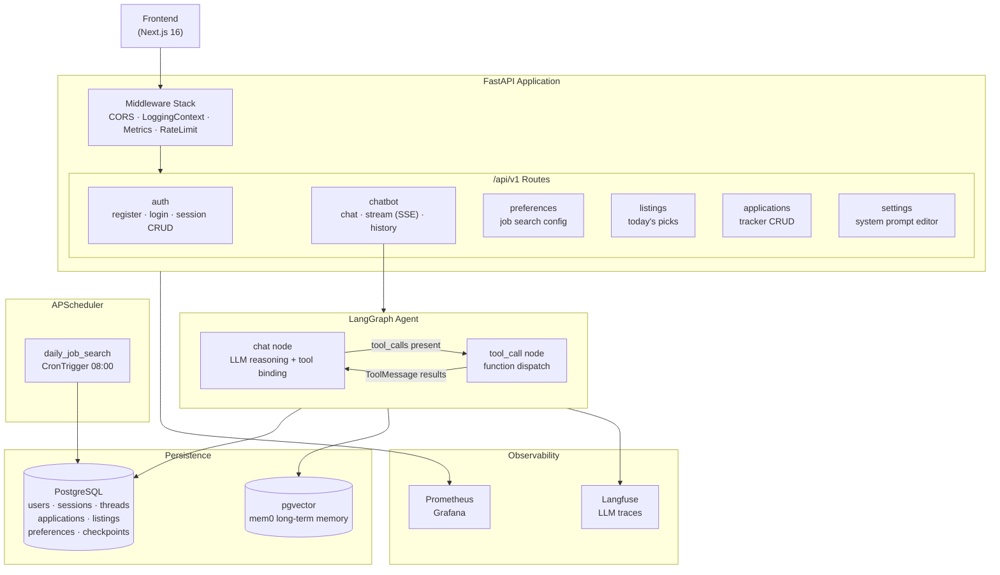
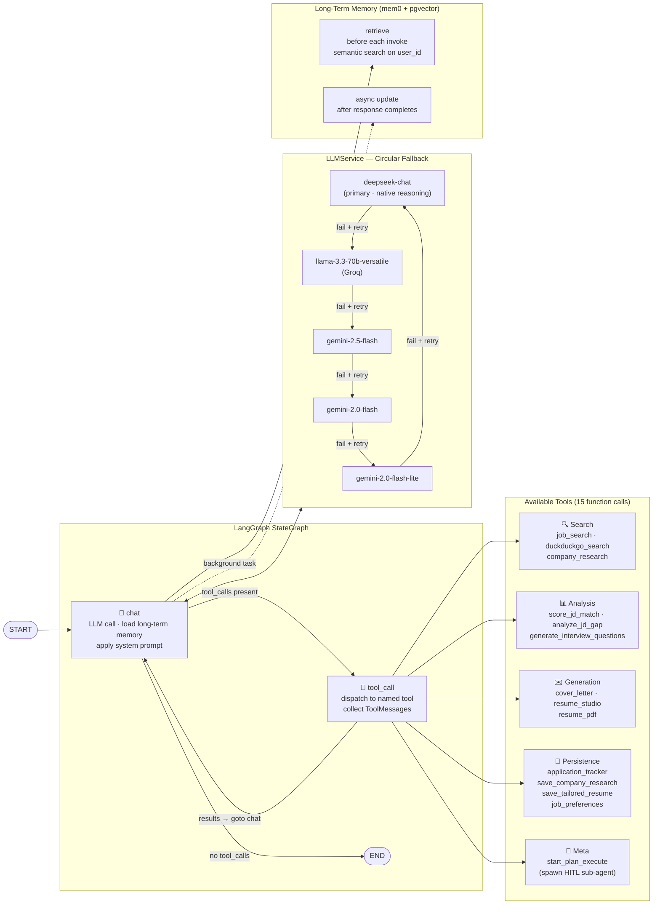

# Job Hunter Agent

> AI-powered job hunting assistant — automates job search, company research, cover letter writing, and application tracking via a LangGraph conversational agent.

---

## Features

| Feature | Description |
|---|---|
| **Job Search** | Search LinkedIn, Indeed, BOSS 直聘, Lagou by keyword + location + job type via DuckDuckGo |
| **Company Research** | Research target company overview, culture (Glassdoor), recent news, and funding |
| **Resume Tailoring + PDF** | LLM-generated tailored resume text + weasyprint PDF export with signed download URLs |
| **JD ↔ Resume Match Scoring** | Score JD/resume match across skills/experience/domain/soft with weighted breakdown |
| **Interview Prep** | Generate interview questions + JD gap analysis based on the tailored resume |
| **Application Tracking (Kanban)** | Drag-and-drop kanban board with 5 states (pending / applied / interviewing / completed / not_a_match), per-card artifacts |
| **Plan & Execute (HITL)** | Agent self-planning with human approval gates — user can approve, revise with feedback, or cancel multi-step plans |
| **Daily Auto-Search** | Save search preferences; APScheduler cron fetches new listings into "Today's Picks" |
| **Long-Term Memory** | Cross-session memory of user skills, experience, and preferences for personalized responses |
| **Custom System Prompt** | Per-user editable system prompt with a modal UI |
| **Streaming Chat** | Real-time SSE streaming with live tool-call cards in the frontend |
| **Onboarding Tour** | First-login UI tour + seeded tutorial session with default resume (bilingual zh-CN / en) |
| **Google OAuth** | Single-click login via Google ID token verification |

---

## Tech Stack

### Backend

| Category | Technology |
|---|---|
| Runtime | Python 3.13, uvloop |
| Web Framework | FastAPI |
| AI Orchestration | LangGraph (StateGraph + AsyncPostgresSaver, nested plan-execute subgraph with HITL `interrupt()`) |
| LLM Models | DeepSeek Chat (primary) → Llama 3.3 70B (Groq) → Gemini 2.5/2.0/2.0-lite Flash (circular fallback) |
| Long-Term Memory | mem0ai + pgvector |
| Web Search | LangChain DuckDuckGoSearchResults |
| PDF Generation | weasyprint + Jinja2 |
| Database / ORM | PostgreSQL, SQLModel (asyncpg) |
| Observability | Langfuse (LLM tracing), structlog (structured logs) |
| Metrics | Prometheus + Grafana |
| Scheduling | APScheduler (AsyncIOScheduler) |
| Resilience | tenacity (exponential backoff retries) |
| Rate Limiting | slowapi |
| Auth | JWT (python-jose) + Google OAuth 2.0 |
| Testing | pytest 8 + pytest-asyncio + httpx ASGI client (49 tests, see [Testing](#testing)) |

### Frontend

| Category | Technology |
|---|---|
| Framework | Next.js 16, React 19, TypeScript |
| Styling | Tailwind CSS 4 |
| Kanban | @dnd-kit (drag-and-drop) |
| Onboarding Tour | driver.js |
| i18n | Custom LanguageContext + `lib/i18n.ts` dictionaries (zh-CN / en) |
| Markdown | react-markdown + remark-gfm |
| Testing | Vitest + React Testing Library + jsdom (6 tests) |

---

## Architecture

### Backend Request Flow



### LangGraph Graph & Function Calls



---

## Quick Start

### Prerequisites

- Python 3.13+ managed by [uv](https://docs.astral.sh/uv/)
- PostgreSQL with pgvector extension (or `docker compose up db` for a ready-made pgvector/pg16 container)
- Node 22+ and pnpm 10+ for the frontend
- Docker + OrbStack (optional, for containerized setup)

### Setup

```bash
# 1. Install dependencies
uv sync

# 2. Configure environment
cp .env.example .env.development
# Edit .env.development with your keys

# 3. Run (development)
make dev
```

Open Swagger UI at `http://localhost:8000/docs`.

### Environment Variables

```bash
# App
APP_ENV=development
PROJECT_NAME="Job Hunter Agent"

# Database
POSTGRES_HOST=localhost
POSTGRES_PORT=5432
POSTGRES_DB=jobhunter
POSTGRES_USER=myuser
POSTGRES_PASSWORD=mypassword

# LLM — at least one provider required; LLMService cycles through all available
DEEPSEEK_API_KEY=your_deepseek_key      # primary
GROQ_API_KEY=your_groq_key              # for llama-3.3-70b fallback
OPENAI_API_KEY=your_openai_or_gemini_key  # for Gemini via OpenAI-compatible endpoint
LLM_BASE_URL=https://generativelanguage.googleapis.com/v1beta/openai/  # optional
DEFAULT_LLM_MODEL=deepseek-chat

# Long-Term Memory
LONG_TERM_MEMORY_COLLECTION_NAME=agent_memories
LONG_TERM_MEMORY_MODEL=gpt-5-nano
LONG_TERM_MEMORY_EMBEDDER_MODEL=gemini-embedding-001

# Observability
LANGFUSE_PUBLIC_KEY=your_public_key
LANGFUSE_SECRET_KEY=your_secret_key
LANGFUSE_HOST=https://cloud.langfuse.com

# Auth
GOOGLE_CLIENT_ID=your-client-id.apps.googleusercontent.com
JWT_SECRET_KEY=your_jwt_secret
JWT_ALGORITHM=HS256
JWT_ACCESS_TOKEN_EXPIRE_DAYS=30
```

### Docker

```bash
make docker-run                    # development
make docker-run-env ENV=staging    # staging
make docker-logs ENV=development
make docker-stop ENV=development
```

Monitoring stack:
- Prometheus: `http://localhost:9090`
- Grafana: `http://localhost:3000` (admin / admin)

---

## API Reference

### Auth
| Method | Path | Description |
|---|---|---|
| POST | `/api/v1/auth/google` | Google OAuth login (verify Google ID token → issue JWT) |
| POST | `/api/v1/auth/session` | Create a new chat session |
| PATCH | `/api/v1/auth/session/{id}/name` | Rename a session |
| DELETE | `/api/v1/auth/session/{id}` | Delete a session |
| GET | `/api/v1/auth/sessions` | List user sessions |

### Chat
| Method | Path | Description |
|---|---|---|
| POST | `/api/v1/chatbot/chat/stream` | SSE streaming response (content / tool_call / tool_result / done events) |
| POST | `/api/v1/chatbot/plan-execute` | Start / resume Plan-and-Execute sub-agent (SSE + HITL) |
| GET | `/api/v1/chatbot/messages` | Get conversation history |
| DELETE | `/api/v1/chatbot/messages` | Clear conversation history |

### Job Data
| Method | Path | Description |
|---|---|---|
| GET/PUT | `/api/v1/preferences` | Get/update daily search config |
| GET | `/api/v1/listings` | List today's auto-discovered jobs |
| GET/POST/PATCH/DELETE | `/api/v1/applications` | Application tracker CRUD (+ `/batch` for scheduler bulk insert) |

### Resume
| Method | Path | Description |
|---|---|---|
| GET | `/api/v1/resume/download/{token}` | Download tailored resume PDF via signed token |

### Tutorial
| Method | Path | Description |
|---|---|---|
| GET | `/api/v1/tutorial/status` | Get onboarding state (has_tutorial_session / completed / resume_is_default) |
| POST | `/api/v1/tutorial/seed` | Idempotently create tutorial session + default resume |
| POST | `/api/v1/tutorial/replay` | Reset tutorial completion + ensure session |
| POST | `/api/v1/tutorial/dismiss` | Mark tutorial as completed |

### Search
| Method | Path | Description |
|---|---|---|
| GET/PUT | `/api/v1/search/config` | Get/update target sites + cron schedule |
| POST | `/api/v1/search/run` | Trigger a manual search now |

### Settings
| Method | Path | Description |
|---|---|---|
| GET/PUT/DELETE | `/api/v1/settings/system-prompt` | Get/update/reset custom system prompt |
| GET/PUT | `/api/v1/settings/resume` | Get/update the user's plain-text resume |
| GET | `/api/v1/settings/langfuse-url` | Get Langfuse project base URL for trace links |

### Health
| Method | Path | Description |
|---|---|---|
| GET | `/health` | Health check with DB status |
| GET | `/metrics` | Prometheus metrics |

---

## Testing

### Backend

```bash
make test         # run all tests (requires local Postgres on :5432)
make test-fast    # skip @pytest.mark.slow tests
uv run pytest tests/integration -v   # integration only
uv run pytest -k "auth"              # filter by name
```

Tests live in `tests/` (`tests/unit/`, `tests/integration/`, `tests/support/`). The conftest auto-creates `jha_test` DB at import time, so the only pre-req is a running Postgres reachable as `myuser/mypassword`. Every integration test uses an in-process httpx ASGI client against the real FastAPI app.

**Layers covered:**
- 8 router integration tests (auth / listings / preferences / settings / applications / tutorial / chatbot / search)
- 4 LLMService resilience unit tests (retry + circular model fallback)
- 4 main LangGraph tests (3 node units + 1 ReAct loop integration)
- 8 plan-execute tests (3 routes + 3 nodes + 2 HITL integration)
- 3 SSE streaming contract tests for `/chat/stream`
- 3 tool parser tests
- 1 migration idempotency regression test
- 1 `/health` smoke test

All LLM calls mocked at the `BaseChatModel` boundary via shared helpers in `tests/support/fake_llm.py`.

### Frontend

```bash
cd frontend
pnpm test         # vitest run
pnpm test:watch   # watch mode
pnpm test:ui      # vitest browser UI
```

Vitest + React Testing Library + jsdom. Covers `lib/i18n.ts` pure function + `SessionContext` provider wiring.

### CI

`.github/workflows/test.yaml` runs backend (Postgres service container) + frontend jobs on every PR and every push to `master`. Deploy (`deploy.yaml`) is gated via `workflow_run` — it only fires after Tests succeed (with `workflow_dispatch force=true` as emergency escape hatch).

---

## Model Evaluation

```bash
make eval           # interactive mode
make eval-quick     # non-interactive, default settings
make eval-no-report # skip JSON report
```

The evaluator fetches Langfuse traces from the last 24 hours, scores them with OpenAI structured output against metric prompts in `evals/metrics/prompts/*.md`, and writes a JSON report to `evals/reports/`.

To add a custom metric, create a new `.md` file in `evals/metrics/prompts/` — it is auto-discovered at runtime.

---

## Project Structure

```
Job-Hunter-Agent/
├── app/
│   ├── api/v1/
│   │   ├── auth.py              # Google OAuth + session CRUD
│   │   ├── chatbot.py           # /chat/stream (SSE) + /plan-execute (HITL) + /messages
│   │   ├── preferences.py       # Job search keywords/location config
│   │   ├── listings.py          # Today's auto-discovered picks
│   │   ├── applications.py      # Kanban tracker CRUD + batch
│   │   ├── resume.py            # Tailored-resume PDF download (signed token)
│   │   ├── search.py            # Search config + manual trigger
│   │   ├── settings.py          # System prompt + resume + langfuse URL
│   │   ├── tutorial.py          # Onboarding: status / seed / replay / dismiss
│   │   └── api.py               # Router aggregation
│   ├── core/
│   │   ├── config.py            # Settings (env-aware per APP_ENV)
│   │   ├── logging.py           # structlog setup
│   │   ├── metrics.py           # Prometheus counters/histograms
│   │   ├── middleware.py        # LoggingContext + Metrics middleware
│   │   ├── limiter.py           # slowapi rate limiter (per-endpoint)
│   │   ├── scheduler.py         # APScheduler cron (daily auto-search)
│   │   ├── pdf_cleanup.py       # Expired PDF artifact sweeper
│   │   ├── langgraph/
│   │   │   ├── graph.py         # Main LangGraphAgent (chat ⇄ tool_call ReAct)
│   │   │   ├── plan_execute.py  # PE sub-agent (planner / approval / executor / replanner, HITL interrupt)
│   │   │   └── tools/           # 15 tools: search / analysis / generation / persistence / meta
│   │   ├── tutorial/            # Bilingual onboarding content (default resume + mock card)
│   │   └── prompts/             # System prompt + planner/replanner prompt templates
│   ├── models/                  # SQLModel: User / Session / Application / JobListing / JobPreference / SearchConfig
│   ├── schemas/                 # Pydantic: auth / chat / graph / plan_execute / resume
│   ├── services/
│   │   ├── database.py          # DatabaseService (SQLModel + asyncpg)
│   │   ├── llm.py               # LLMService (circular fallback across 5 models)
│   │   ├── job_service.py       # Application/listing/preference DB ops
│   │   ├── scoring_service.py   # JD↔resume match weighted score
│   │   └── resume_pdf_service.py  # weasyprint subprocess + signed URLs
│   ├── utils/                   # JWT, LangGraph message helpers, sanitization
│   └── main.py                  # FastAPI entry point
├── tests/                       # pytest (49 tests): unit/ + integration/ + support/fake_llm.py
├── frontend/                    # Next.js 16 + React 19 + Tailwind 4 + Vitest
├── evals/                       # Langfuse-based evaluation harness
├── scripts/                     # migrate.py (idempotent DB migration)
├── docs/superpowers/            # specs/ (design docs) + plans/ (implementation plans)
├── grafana/                     # Dashboard configs
├── prometheus/                  # Scrape config
├── .github/workflows/           # test.yaml (PR + push CI) + deploy.yaml (gated on tests)
├── docker-compose.yml
├── Dockerfile
└── Makefile
```

---

## License

See [LICENSE](LICENSE).
