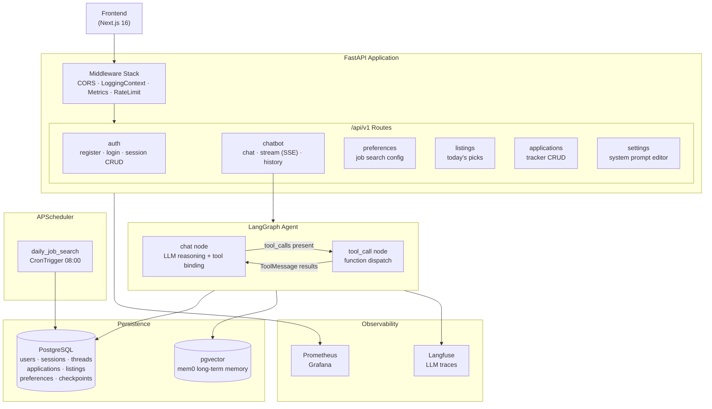
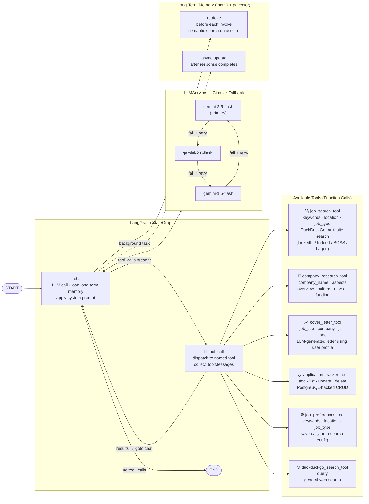

# Job Hunter Agent

> AI-powered job hunting assistant — automates job search, company research, cover letter writing, and application tracking via a LangGraph conversational agent.

---

## Features

| Feature | Description |
|---|---|
| **Job Search** | Search LinkedIn, Indeed, BOSS 直聘, Lagou by keyword + location + job type via DuckDuckGo |
| **Company Research** | Research target company overview, culture (Glassdoor), recent news, and funding |
| **Cover Letter Generation** | Generate personalized cover letters/emails using the user's stored profile |
| **Application Tracking** | Record and manage job applications with status lifecycle (applied → interviewing → rejected / offer) |
| **Daily Auto-Search** | Save search preferences; a daily 08:00 cron fetches new listings into "Today's Picks" |
| **Long-Term Memory** | Cross-session memory of user skills, experience, and preferences for personalized responses |
| **Custom System Prompt** | Per-user editable system prompt with a modal UI |
| **Streaming Chat** | Real-time SSE streaming with live tool-call cards in the frontend |

---

## Tech Stack

### Backend

| Category | Technology |
|---|---|
| Runtime | Python 3.13, uvloop |
| Web Framework | FastAPI |
| AI Orchestration | LangGraph (StateGraph + AsyncPostgresSaver) |
| LLM Models | Gemini 2.5 Flash / 2.0 Flash / 1.5 Flash (circular fallback) |
| Long-Term Memory | mem0ai + pgvector |
| Web Search | LangChain DuckDuckGoSearchResults |
| Database / ORM | PostgreSQL, SQLModel (asyncpg) |
| Observability | Langfuse (LLM tracing), structlog (structured logs) |
| Metrics | Prometheus + Grafana |
| Scheduling | APScheduler (AsyncIOScheduler) |
| Resilience | tenacity (exponential backoff retries) |
| Rate Limiting | slowapi |
| Auth | JWT (python-jose) |

### Frontend

| Category | Technology |
|---|---|
| Framework | Next.js 16, React 19, TypeScript |
| Styling | Tailwind CSS 4 |

---

## Architecture

### Backend Request Flow



### LangGraph Graph & Function Calls



---

## Quick Start

### Prerequisites

- Python 3.13+
- PostgreSQL with pgvector extension
- Docker + OrbStack (optional, for containerized setup)

### Setup

```bash
# 1. Install dependencies
uv sync

# 2. Configure environment
cp .env.example .env.development
# Edit .env.development with your keys

# 3. Run (development)
make dev
```

Open Swagger UI at `http://localhost:8000/docs`.

### Environment Variables

```bash
# App
APP_ENV=development
PROJECT_NAME="Job Hunter Agent"

# Database
POSTGRES_HOST=localhost
POSTGRES_PORT=5432
POSTGRES_DB=jobhunter
POSTGRES_USER=postgres
POSTGRES_PASSWORD=postgres

# LLM (OpenAI-compatible endpoint)
OPENAI_API_KEY=your_api_key
LLM_BASE_URL=https://generativelanguage.googleapis.com/v1beta/openai/  # optional
DEFAULT_LLM_MODEL=gemini-2.5-flash

# Long-Term Memory
LONG_TERM_MEMORY_COLLECTION_NAME=agent_memories
LONG_TERM_MEMORY_MODEL=gemini-2.0-flash
LONG_TERM_MEMORY_EMBEDDER_MODEL=text-embedding-004

# Observability
LANGFUSE_PUBLIC_KEY=your_public_key
LANGFUSE_SECRET_KEY=your_secret_key
LANGFUSE_HOST=https://cloud.langfuse.com

# Security
SECRET_KEY=your_secret_key
ACCESS_TOKEN_EXPIRE_MINUTES=30
```

### Docker

```bash
make docker-run                    # development
make docker-run-env ENV=staging    # staging
make docker-logs ENV=development
make docker-stop ENV=development
```

Monitoring stack:
- Prometheus: `http://localhost:9090`
- Grafana: `http://localhost:3000` (admin / admin)

---

## API Reference

### Auth
| Method | Path | Description |
|---|---|---|
| POST | `/api/v1/auth/register` | Register a new user |
| POST | `/api/v1/auth/login` | Login and get JWT token |
| GET | `/api/v1/auth/sessions` | List user sessions |
| DELETE | `/api/v1/auth/sessions/{id}` | Delete a session |

### Chat
| Method | Path | Description |
|---|---|---|
| POST | `/api/v1/chatbot/chat` | Send message, get response |
| POST | `/api/v1/chatbot/chat/stream` | SSE streaming response |
| GET | `/api/v1/chatbot/history` | Get conversation history |
| DELETE | `/api/v1/chatbot/history` | Clear conversation history |

### Job Data
| Method | Path | Description |
|---|---|---|
| GET/PUT | `/api/v1/preferences` | Get/update daily search config |
| GET | `/api/v1/listings` | List today's auto-discovered jobs |
| GET/POST/PATCH/DELETE | `/api/v1/applications` | Application tracker CRUD |

### Settings
| Method | Path | Description |
|---|---|---|
| GET/PUT | `/api/v1/settings/system-prompt` | Get/update custom system prompt |

### Health
| Method | Path | Description |
|---|---|---|
| GET | `/health` | Health check with DB status |
| GET | `/metrics` | Prometheus metrics |

---

## Model Evaluation

```bash
make eval           # interactive mode
make eval-quick     # non-interactive, default settings
make eval-no-report # skip JSON report
```

The evaluator fetches Langfuse traces from the last 24 hours, scores them with OpenAI structured output against metric prompts in `evals/metrics/prompts/*.md`, and writes a JSON report to `evals/reports/`.

To add a custom metric, create a new `.md` file in `evals/metrics/prompts/` — it is auto-discovered at runtime.

---

## Project Structure

```
Job-Hunter-Agent/
├── app/
│   ├── api/v1/
│   │   ├── auth.py              # Auth endpoints
│   │   ├── chatbot.py           # Chat + SSE stream endpoints
│   │   ├── preferences.py       # Job search config
│   │   ├── listings.py          # Today's picks
│   │   ├── applications.py      # Application tracker
│   │   ├── settings.py          # System prompt editor
│   │   └── api.py               # Router aggregation
│   ├── core/
│   │   ├── config.py            # Settings (env-aware)
│   │   ├── logging.py           # structlog setup
│   │   ├── metrics.py           # Prometheus counters/histograms
│   │   ├── middleware.py        # LoggingContext + Metrics middleware
│   │   ├── limiter.py           # slowapi rate limiter
│   │   ├── scheduler.py         # APScheduler daily cron
│   │   ├── langgraph/
│   │   │   ├── graph.py         # LangGraphAgent (StateGraph + checkpointer + mem0)
│   │   │   └── tools/
│   │   │       ├── job_search.py
│   │   │       ├── company_research.py
│   │   │       ├── cover_letter.py
│   │   │       ├── application_tracker.py
│   │   │       ├── job_preferences.py
│   │   │       └── duckduckgo_search.py
│   │   └── prompts/
│   │       └── system.md        # Agent system prompt template
│   ├── models/                  # SQLModel ORM tables
│   ├── schemas/                 # Pydantic I/O schemas
│   ├── services/
│   │   ├── database.py          # DatabaseService (asyncpg)
│   │   ├── llm.py               # LLMService (retry + circular fallback)
│   │   └── job_service.py       # Application/listing/preference DB ops
│   ├── utils/                   # JWT, LangGraph message helpers, sanitization
│   └── main.py                  # FastAPI entry point
├── frontend/                    # Next.js 16 + React 19 + Tailwind CSS 4
├── evals/                       # Langfuse-based evaluation harness
├── grafana/                     # Dashboard configs
├── prometheus/                  # Scrape config
├── docker-compose.yml
├── Dockerfile
└── Makefile
```

---

## License

See [LICENSE](LICENSE).
