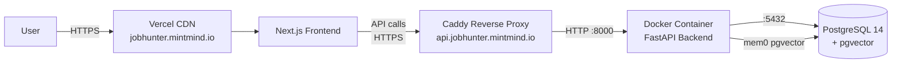

# Deployment Guide

## Architecture Overview



| Component | Host | URL |
|-----------|------|-----|
| Frontend (Next.js) | Vercel | `https://jobhunter.mintmind.io` |
| Backend (FastAPI) | Oracle ARM64 Server | `https://api.jobhunter.mintmind.io` |
| Database (PostgreSQL) | Oracle ARM64 Server | `127.0.0.1:5432` |

## Server Access

```bash
ssh -i ~/.ssh/oracle-ssh-keys/ssh-key-2025-07-12.key ubuntu@137.131.22.123
```

Backend project directory: `/home/ubuntu/apps/job-hunter-agent`

---

## Backend Deployment

### Prerequisites

Server already runs:
- PostgreSQL 14 with pgvector extension (host network, port 5432)
- Caddy (reverse proxy with auto HTTPS)

### Deploy / Update

```bash
# SSH into server
ssh -i ~/.ssh/oracle-ssh-keys/ssh-key-2025-07-12.key ubuntu@137.131.22.123

# Pull latest code
cd /home/ubuntu/apps/job-hunter-agent
git fetch origin master
git checkout -f FETCH_HEAD

# Rebuild and restart
docker compose -f docker-compose.prod.yml up -d --build
```

### Key Files

| File | Purpose |
|------|---------|
| `docker-compose.prod.yml` | Production compose (app only, `network_mode: host`) |
| `Dockerfile` | Multi-stage build with uv, Python 3.13 |
| `scripts/docker-entrypoint.sh` | Loads env, runs migrations, starts uvicorn |
| `scripts/migrate.py` | Idempotent database migrations |
| `.env.production` | Production env vars (on server, not in git) |

### Environment Variables (.env.production)

```bash
APP_ENV=production
POSTGRES_HOST=127.0.0.1
POSTGRES_PORT=5432
POSTGRES_DB=jobhunter_db
POSTGRES_USER=jobhunter
POSTGRES_PASSWORD=<secret>

# LLM
DEEPSEEK_API_KEY=<secret>
GROQ_API_KEY=<secret>
OPENAI_API_KEY=<secret>       # Actually Google AI key for embeddings
GOOGLE_API_KEY=<secret>
LLM_BASE_URL=https://generativelanguage.googleapis.com/v1beta/openai/
DEFAULT_LLM_MODEL=deepseek-chat

# mem0
LONG_TERM_MEMORY_MODEL=deepseek-chat
LONG_TERM_MEMORY_EMBEDDER_MODEL=gemini-embedding-001

# Auth
JWT_SECRET_KEY=<secret>
GOOGLE_CLIENT_ID=<from Google Cloud Console>

# Langfuse
LANGFUSE_PUBLIC_KEY=<secret>
LANGFUSE_SECRET_KEY=<secret>
LANGFUSE_HOST=https://us.cloud.langfuse.com

# CORS
ALLOWED_ORIGINS="https://jobhunter.mintmind.io,https://job-hunter-agent.vercel.app,http://localhost:3000"
```

### Caddy Config

Site configs live in `caddy/sites/` and are synced to `/etc/caddy/sites/` on deploy.

| File | Domain | Target |
|------|--------|--------|
| `api.jobhunter.mintmind.io.conf` | `api.jobhunter.mintmind.io` | `127.0.0.1:8000` (FastAPI) |
| `grafana.mintmind.io.conf` | `grafana.mintmind.io` | `127.0.0.1:13000` (Grafana) |
| `prometheus.mintmind.io.conf` | `prometheus.mintmind.io` | `127.0.0.1:19090` (Prometheus, basic auth) |
| `cadvisor.mintmind.io.conf` | `cadvisor.mintmind.io` | `127.0.0.1:18080` (cAdvisor, basic auth) |
| `pgweb.mintmind.io.conf` | `pgweb.mintmind.io` | `127.0.0.1:15050` (pgweb, basic auth) |

Caddy handles automatic HTTPS via Let's Encrypt. Restart with `systemctl restart caddy` (not reload, since admin API is disabled).

Prometheus, cAdvisor, and pgweb basic auth credentials: `admin` / `jobhunter`

### Docker Architecture

- `network_mode: host` — app container shares host network, connects to PostgreSQL on localhost
- Monitoring stack (Prometheus, Grafana, cAdvisor) runs on a `monitoring` bridge network
- Prometheus reaches the app via `host.docker.internal:8000`
- All monitoring ports bind to `127.0.0.1` only — public access via Caddy reverse proxy
- Health check: `curl -f http://localhost:8000/health` (30s interval)
- Log rotation: 10MB max, 3 files

### Monitoring

```bash
# Container logs
docker logs job-hunter-agent-app-1 --tail 50 -f

# Health check
curl https://api.jobhunter.mintmind.io/health

# Container status
docker ps

# Monitoring dashboards
# Grafana:    https://grafana.mintmind.io    (Grafana login)
# Prometheus: https://prometheus.mintmind.io  (basic auth: admin / jobhunter)
# cAdvisor:   https://cadvisor.mintmind.io    (basic auth: admin / jobhunter)
# pgweb:      https://pgweb.mintmind.io       (basic auth: admin / jobhunter)
```

### Image Tags & Automated Maintenance

Every deploy produced by `.github/workflows/deploy.yaml` tags the backend image twice:
- `job-hunter-agent-app:latest` — what the running container uses
- `job-hunter-agent-app:sha-<7-char-commit>` — named history for audit / rollback lookup

Rolling back to a prior build without rebuilding:

```bash
docker tag job-hunter-agent-app:sha-<old-commit> job-hunter-agent-app:latest
docker compose -f docker-compose.prod.yml up -d app
```

Server-side cron (`/etc/cron.d/docker-image-cleanup`) runs every Sunday 03:00 UTC:
- `docker image prune -a -f --filter "until=720h"` — drops images unreferenced for 30d+
- `docker builder prune -a -f --filter "until=720h"` — reclaims stale build cache

Running containers' images are never touched. Logs: `journalctl -t docker-prune`.

---

## Frontend Deployment

### Prerequisites

- Vercel account with project linked to `frontend/` directory
- Domain `mintmind.io` managed in Vercel DNS

### Deploy / Update

```bash
cd frontend
npx vercel --prod
```

Or push to `master` — Vercel auto-deploys if connected to GitHub.

### Environment Variables (Vercel)

Set via Vercel Dashboard or CLI:

```bash
# Set (use echo -n to avoid trailing newline!)
echo -n "value" | npx vercel env add NEXT_PUBLIC_GOOGLE_CLIENT_ID production
echo -n "https://api.jobhunter.mintmind.io" | npx vercel env add NEXT_PUBLIC_API_URL production

# List
npx vercel env ls

# Remove
npx vercel env rm NEXT_PUBLIC_GOOGLE_CLIENT_ID production --yes
```

| Variable | Value |
|----------|-------|
| `NEXT_PUBLIC_API_URL` | `https://api.jobhunter.mintmind.io` |
| `NEXT_PUBLIC_GOOGLE_CLIENT_ID` | `<from Google Cloud Console>` |

> **Important:** `NEXT_PUBLIC_*` vars are baked into the JS bundle at build time. After changing them, you must redeploy.

> **Gotcha:** When piping values to `vercel env add`, use `echo -n` to avoid a trailing newline (`\n`) being included in the value. A trailing newline in `NEXT_PUBLIC_GOOGLE_CLIENT_ID` will cause Google Sign-In to fail with "The OAuth client was not found."

### Domain

`jobhunter.mintmind.io` is configured as an alias in Vercel, with DNS managed by Vercel for `mintmind.io`.

---

## Google OAuth Setup

Project: `first-project` (ID: `gen-lang-client-0132967258`)
Console: https://console.cloud.google.com/auth/clients?project=gen-lang-client-0132967258

### OAuth Client

- Type: Web application
- Name: Job Hunter Web
- Authorized JavaScript origins:
  - `https://jobhunter.mintmind.io`
  - `http://localhost:3000`
- No redirect URIs needed (ID Token flow)

### Branding (OAuth Consent Screen)

Must be fully configured for Google Identity Services to recognize the Client ID:
- App name: `Job Hunter`
- User support email: set
- Application home page: `https://jobhunter.mintmind.io`
- Application privacy policy link: `https://jobhunter.mintmind.io`
- Authorized domain: `mintmind.io`
- Publishing status: **In production** (not Testing)

---

## Common Operations

### Full Redeploy (both)

```bash
# Backend
ssh -i ~/.ssh/oracle-ssh-keys/ssh-key-2025-07-12.key ubuntu@137.131.22.123 \
  "cd /home/ubuntu/apps/job-hunter-agent && git fetch origin master && git checkout -f FETCH_HEAD && docker compose -f docker-compose.prod.yml up -d --build"

# Frontend
cd frontend && npx vercel --prod
```

### View Backend Logs

```bash
ssh -i ~/.ssh/oracle-ssh-keys/ssh-key-2025-07-12.key ubuntu@137.131.22.123 \
  "docker logs job-hunter-agent-app-1 --tail 100 -f"
```

### Database Access

```bash
ssh -i ~/.ssh/oracle-ssh-keys/ssh-key-2025-07-12.key ubuntu@137.131.22.123 \
  "psql -h 127.0.0.1 -U jobhunter -d jobhunter_db"
```

### Restart Without Rebuild

```bash
ssh -i ~/.ssh/oracle-ssh-keys/ssh-key-2025-07-12.key ubuntu@137.131.22.123 \
  "docker compose -f /home/ubuntu/apps/job-hunter-agent/docker-compose.prod.yml restart"
```
