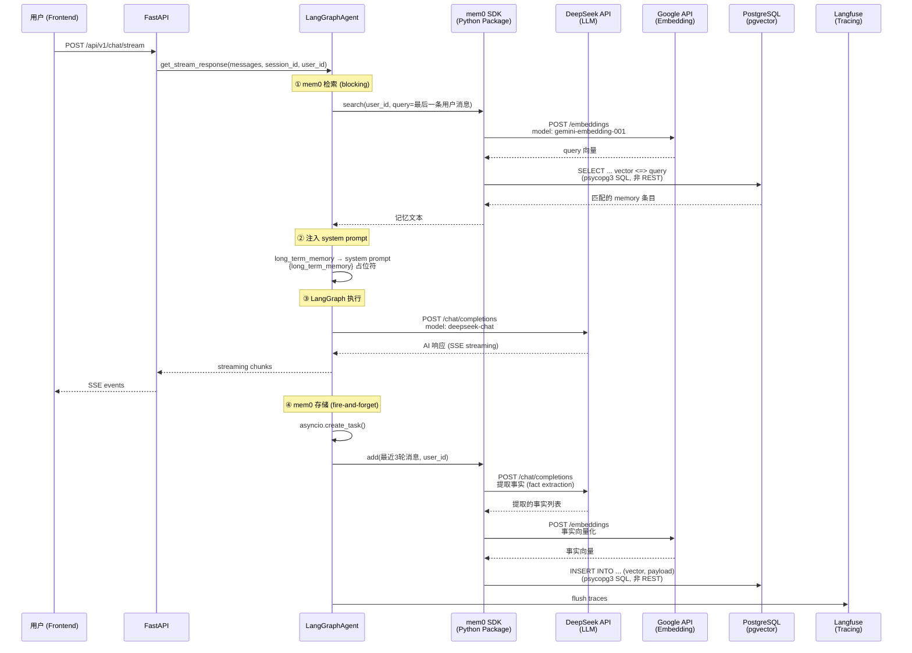
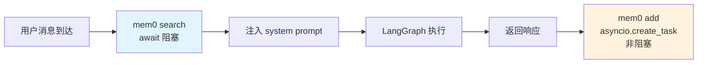

# mem0 长期记忆集成文档

## 架构概览

### 整体交互链路



### 协议说明

| 组件间通信 | 协议 | 说明 |
|-----------|------|------|
| mem0 → DeepSeek | **HTTP REST** | OpenAI 兼容 `/chat/completions` 端点 |
| mem0 → Google | **HTTP REST** | OpenAI 兼容 `/embeddings` 端点 |
| mem0 → PostgreSQL | **SQL over TCP** | psycopg3 连接池，原生 PostgreSQL 协议，非 REST |
| Agent → Langfuse | **HTTP REST** | CallbackHandler 通过 OTel 上报 trace |

> mem0 是 Python SDK 包封装（`from mem0 import AsyncMemory`），不暴露显式的 RESTful API。
> 对外调用（LLM/Embedding）走 HTTP REST，对内存储（pgvector）走 SQL。

## 模型配置

| 用途 | 模型 | Provider | Base URL | API Key 来源 | 备注 |
|------|------|----------|----------|-------------|------|
| 主聊天 LLM | `deepseek-chat` | DeepSeek | `https://api.deepseek.com` | `DEEPSEEK_API_KEY` | 主模型，支持 tool calling |
| Analyze 节点 LLM | `deepseek-chat` | DeepSeek（经 LLMRegistry） | 同上 | `DEEPSEEK_API_KEY` | 无 tool binding 的 plain LLM |
| mem0 事实提取 LLM | `deepseek-chat` | DeepSeek | `https://api.deepseek.com` | `DEEPSEEK_API_KEY` | 从对话中提取事实 |
| mem0 Embedding | `gemini-embedding-001` | Google | `https://generativelanguage.googleapis.com/v1beta/openai/` | `OPENAI_API_KEY`（实际存 Google API Key） | 向量维度 3072 |
| Fallback LLM #1 | `llama-3.3-70b-versatile` | Groq | `https://api.groq.com/openai/v1` | `GROQ_API_KEY` | LLMService 循环降级备选 |
| Fallback LLM #2 | `gemini-2.5-flash` | Google | `https://generativelanguage.googleapis.com/v1beta/openai/` | `OPENAI_API_KEY` | LLMService 循环降级备选 |

### 配额隔离设计

- **主 LLM + mem0 LLM** 共享 DeepSeek 配额（付费，额度充裕）
- **mem0 Embedding** 走 Google API（免费 tier，5-15 RPM，轻量调用足够）
- 两者分走不同 provider，避免单一 provider 配额打满导致全链路故障

## mem0 检索（Search）

### 触发时机

**每次用户发送消息时，在 LangGraph graph 执行之前，同步等待（blocking）。**



### 代码位置

- `app/core/langgraph/graph.py` → `_get_relevant_memory()` 方法
- 调用点：`get_response()` 和 `get_stream_response()` 内部

```python
# get_response() / get_stream_response() 中：
relevant_memory = (
    await self._get_relevant_memory(user_id, messages[-1].content)
) or "No relevant memory found."
```

### 使用的 Context

| 参数 | 来源 | 说明 |
|------|------|------|
| `user_id` | `session.user_id`（JWT 解析） | 跨 session 一致，同一用户共享记忆 |
| `query` | `messages[-1].content` | **仅最后一条用户消息**，非整个 session |

### 检索结果注入

检索到的记忆以字符串形式注入到 `GraphState.long_term_memory` 字段，最终格式化进 system prompt 的 `{long_term_memory}` 占位符：

```markdown
# What you know about the user
* 用户名是小明
* 用户是 Python 程序员
* 用户喜欢使用 Claude Code
```

### 内部调用链

```
_get_relevant_memory(user_id, query)
  → AsyncMemory.search(user_id=user_id, query=query)
    → Google Embedding API: POST /embeddings (gemini-embedding-001, HTTP REST)
    → PostgreSQL: SELECT ... vector <=> query::vector (psycopg3, SQL over TCP)
    → 返回匹配的 memory 条目
```

## mem0 存储（Add）

### 触发时机

**每次 graph 执行完成后，以 `asyncio.create_task()` 后台异步执行（non-blocking, fire-and-forget）。**

### 代码位置

- `app/core/langgraph/graph.py` → `_update_long_term_memory()` 方法
- 调用点：`get_response()` 和 `get_stream_response()` 末尾

```python
# get_response() 中：
recent_messages = self._get_recent_rounds(response["messages"])
asyncio.create_task(
    self._update_long_term_memory(
        user_id, convert_to_openai_messages(recent_messages), config["metadata"]
    )
)

# get_stream_response() 中：
state: StateSnapshot = await self._graph.aget_state(config=config)
if state.values and "messages" in state.values:
    recent_messages = self._get_recent_rounds(state.values["messages"])
    asyncio.create_task(
        self._update_long_term_memory(
            user_id, convert_to_openai_messages(recent_messages), config["metadata"]
        )
    )
```

### 使用的 Context

| 参数 | 来源 | 说明 |
|------|------|------|
| `user_id` | `session.user_id` | 同检索 |
| `messages` | 最近 3 轮对话（`_get_recent_rounds`） | 非完整 session，滑动窗口 |
| `metadata` | `config["metadata"]` | 包含 user_id, session_id, environment 等 |

### 3 轮滑动窗口

`_get_recent_rounds()` 找到所有 `HumanMessage` 的位置索引，只保留最后 3 轮（每轮 = HumanMessage + 后续所有 AI/Tool 消息），避免重复提取和 token 浪费。

### 内部调用链

```
_update_long_term_memory(user_id, messages, metadata)
  → AsyncMemory.add(messages, user_id=user_id, metadata=metadata)
    → DeepSeek API: POST /chat/completions (deepseek-chat, HTTP REST) — 事实提取
    → Google Embedding API: POST /embeddings (gemini-embedding-001, HTTP REST) — 向量化
    → PostgreSQL: INSERT INTO ... (vector, payload) (psycopg3, SQL over TCP) — 持久化
```

## mem0 初始化

```python
# app/core/langgraph/graph.py → _long_term_memory()
AsyncMemory.from_config(config_dict={
    "vector_store": {
        "provider": "pgvector",
        "embedding_model_dims": 3072,  # gemini-embedding-001 输出维度
        "hnsw": False,                 # 不使用 HNSW 索引
        ...
    },
    "llm": {
        "provider": "openai",
        "model": "deepseek-chat",
        "openai_base_url": "https://api.deepseek.com",
    },
    "embedder": {
        "provider": "openai",
        "model": "gemini-embedding-001",
        "openai_base_url": "https://generativelanguage.googleapis.com/v1beta/openai/",
    },
})
```

实例缓存在 `self.memory`，首次调用时初始化，后续复用。

## OTel Tracing

mem0 操作通过 OpenTelemetry span 暴露给 Langfuse（v3.9.1 OTel 版本）：

- `mem0_search` span — 记录 `user_id`, `query`, `result_count`
- `mem0_add` span — 记录 `user_id`, `message_count`, `result`

```python
from opentelemetry import trace
tracer = trace.get_tracer("langgraph-agent")
with tracer.start_as_current_span("mem0_search", attributes={...}) as span:
    ...
```

Langfuse session 关联通过 metadata 中的 `langfuse_session_id` / `langfuse_user_id` 字段实现（Langfuse 3.x CallbackHandler 从 metadata 中解析）。

## .env 配置项

```bash
# .env.development
DEEPSEEK_API_KEY="sk-..."                              # DeepSeek API Key（主 LLM + mem0 LLM）
OPENAI_API_KEY="AIza..."                               # Google API Key（mem0 Embedding）
LLM_BASE_URL=https://generativelanguage.googleapis.com/v1beta/openai/
DEFAULT_LLM_MODEL=deepseek-chat                        # 主聊天模型
LONG_TERM_MEMORY_MODEL=deepseek-chat                   # mem0 事实提取 LLM
LONG_TERM_MEMORY_EMBEDDER_MODEL=gemini-embedding-001   # mem0 Embedding 模型
LONG_TERM_MEMORY_COLLECTION_NAME=longterm_memory        # pgvector collection 名
```

---

## Debug 踩坑记录

### 1. Google Embedding 模型名带 `models/` 前缀导致 404

**现象：** `models/text-embedding-004 is not found for API version v1main`

**根因：** Google OpenAI 兼容端点 (`/v1beta/openai/`) 不接受 `models/` 前缀。`.env` 中配置为 `models/text-embedding-004`，但正确写法应不带前缀。

**修复：** `LONG_TERM_MEMORY_EMBEDDER_MODEL=gemini-embedding-001`（同时该模型已下线，换为最新稳定版）

### 2. `text-embedding-004` 已下线

**现象：** 即使去掉 `models/` 前缀，`text-embedding-004` 仍然 404。

**根因：** Google 已不在官方模型列表中提供 `text-embedding-004`，替代方案为 `gemini-embedding-001`。

### 3. Google API 429 配额耗尽

**现象：** `Error code: 429 - You exceeded your current quota`

**根因：** mem0 的 LLM 和主 agent 都走 Google API，共享同一个 API key 的配额，并发请求打满免费额度。

**修复：** 将 mem0 LLM 和主 LLM 改为 DeepSeek（`deepseek-chat`），Embedding 保留 Google，实现配额隔离。

### 4. `.env` 修改后 hot reload 不生效

**现象：** 修改 `.env.development` 后，uvicorn `--reload` 重启子进程仍使用旧值。

**根因：** `make dev` 通过 `source scripts/set_env.sh` 将 `.env` 值 export 到 shell 环境变量。uvicorn 重启子进程继承父 shell 环境，而 `load_dotenv()` 默认 `override=False` 不覆盖已存在的环境变量。

**修复：** `config.py` 中 `load_dotenv(dotenv_path=env_file, override=True)`，让文件值始终优先。改完后仍需**首次手动重启 `make dev`**。

### 5. `sync_to_async(self._graph.get_state)` 与 `AsyncPostgresSaver` 不兼容

**现象：** streaming 结束后获取 state 可能静默失败，导致 memory update 从未触发。

**根因：** `get_state` 是同步方法，在 `sync_to_async` 的线程池中无法正确调用异步的 PostgreSQL checkpointer。LangGraph 提供了原生的 `aget_state` 异步方法。

**修复：** 所有 `await sync_to_async(self._graph.get_state)(config)` 替换为 `await self._graph.aget_state(config)`。

### 6. Llama 3.3 tool calling 过于激进

**现象：** 无论用户说什么（包括"你好"、"我是谁？"），模型都会调用 `job_search_tool`。

**根因：** `llama-3.3-70b-versatile` 在 Groq 上的 tool calling 行为激进。系统提示词中 "Job Hunting Specialist" + 7 个工具绑定，模型倾向于总是调用工具。工具描述只有正面触发条件（"Use this when..."），没有负面约束（"Do NOT use when..."）。

**修复：**
- system prompt 新增 `# Tool Usage Rules` 区块，明确"闲聊/问答 → 不调工具"
- 高风险工具（`job_search_tool`, `company_research_tool`, `application_tracker_tool`）描述加入 `ONLY call this tool when...` / `Do NOT call this for...` 约束

### 7. `Message.content` 的 `max_length=3000` 限制了 system prompt

**现象：** system prompt 扩展后超过 3000 字符，Pydantic 校验报错。

**根因：** `Message` schema 的 `content` 字段 `max_length=3000` 同时约束了 `role="system"` 的消息。

**修复：** `max_length` 从 3000 放宽到 50000。

### 8. Langfuse v3.9.1 没有 `decorators` 模块

**现象：** `from langfuse.decorators import langfuse_context, observe` 导入失败。

**根因：** Langfuse 3.x 是 OpenTelemetry 架构，`@observe` 和 `langfuse_context` 是 v2.x 的 API，3.x 中已移除。

**修复：** 改用 OpenTelemetry 原生 `trace.get_tracer()` + `start_as_current_span()` 创建 span，Langfuse 3.x 自动采集 OTel span。

### 9. Langfuse 3.x `CallbackHandler` 不接受 `session_id` 构造参数

**现象：** `LangchainCallbackHandler.__init__() got an unexpected keyword argument 'session_id'`

**根因：** Langfuse 3.x 的 `CallbackHandler` 构造函数签名为 `(self, *, public_key, update_trace)`，不支持 `session_id` / `user_id` 参数（这是 v2 API）。v3 通过 metadata 中的 `langfuse_session_id` / `langfuse_user_id` 字段关联。

**修复：** 使用无参 `CallbackHandler()`，在 config metadata 中设置 `langfuse_session_id` 和 `langfuse_user_id`。
