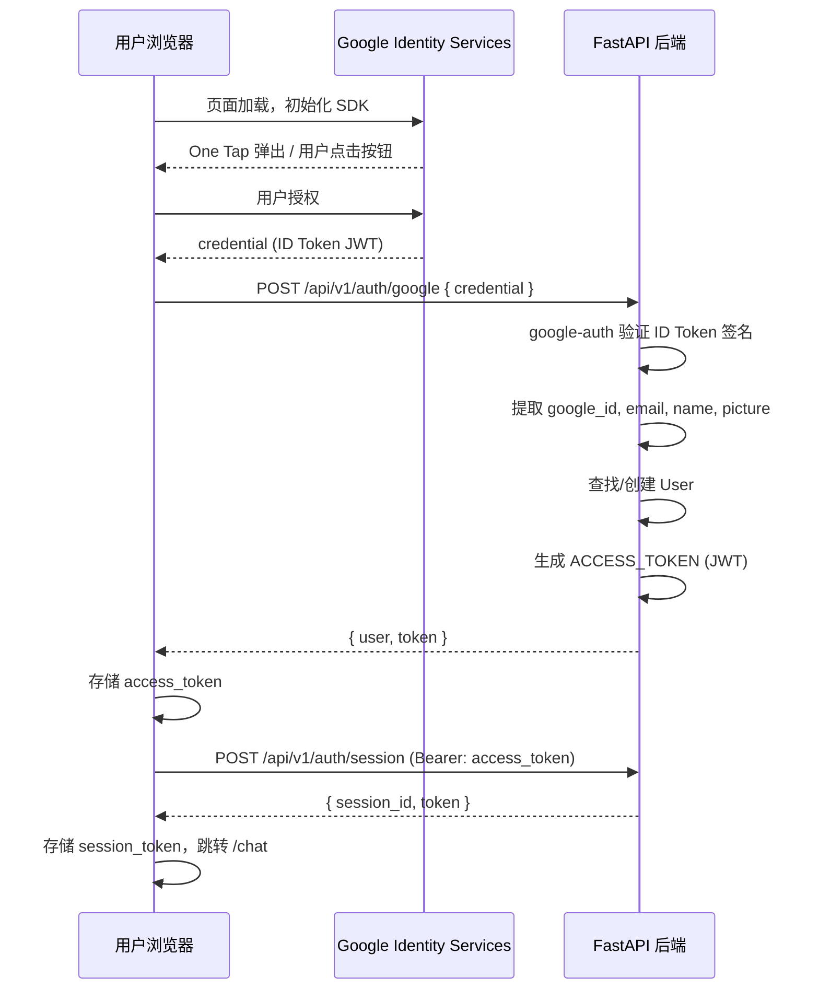

# Google OAuth 登录替换设计

## 概述

将现有 email/password 注册登录系统完全替换为 Google OAuth 登录。使用 Google Identity Services SDK（前端）+ `google-auth` 库（后端验证 ID Token）。会话系统和下游功能不变。

## 整体架构



关键点：
- 只改登录入口（register/login → `/auth/google`）
- 会话系统（Session token、chat、LangGraph）完全不动
- 前端从表单页变为 Google 登录页，登录成功后的流程不变

## 后端改动

### User 模型变更

```python
class User(BaseModel, table=True):
    id: int                          # 不变
    google_id: str                   # 新增，UNIQUE NOT NULL，替代 email 作为查找键
    email: str                       # 保留，从 Google 获取
    name: str                        # 新增，从 Google 获取
    avatar_url: str                  # 新增，从 Google 获取（picture 字段）
    system_prompt: Optional[str]     # 不变
    resume_text: Optional[str]       # 不变
    sessions: List["Session"]        # 不变
    created_at: datetime             # 不变
    # 删除: hashed_password
```

### 新端点 `POST /api/v1/auth/google`

请求体：`{ "credential": "<Google ID Token>" }`

处理流程：
1. `google.oauth2.id_token.verify_oauth2_token(credential, Request(), GOOGLE_CLIENT_ID)` 验证签名
2. 提取 `sub`(google_id)、`email`、`name`、`picture`
3. 按 `google_id` 查找用户：
   - 存在 → 更新 `name`、`avatar_url`（Google 资料可能变化）
   - 不存在 → 创建新用户
4. 生成 `access_token`（复用现有 `create_access_token`）
5. 返回用户信息 + token

响应：`{ user: {id, email, name, avatar_url}, token: {access_token, token_type, expires_at} }`

### 删除的端点

- `POST /auth/register`
- `POST /auth/login`
- `OAuth2PasswordRequestForm` 依赖

### 保留不变的端点

- `POST /auth/session` — 创建会话
- `GET /auth/sessions` — 列出会话
- `PATCH /auth/session/{id}/name` — 重命名会话
- `DELETE /auth/session/{id}` — 删除会话

### 配置新增

```
GOOGLE_CLIENT_ID=<从 Google Cloud Console 获取>
```

### 依赖变更

```
新增: google-auth
删除: bcrypt
```

## 前端改动

### 登录页 `/app/login/page.tsx`

完全重写：
- 页面加载时初始化 Google Identity Services SDK
- 渲染 One Tap 弹出提示（已登录 Google 的用户自动触发）
- 渲染 "Sign in with Google" 按钮作为后备
- 回调拿到 `credential` → 调后端 → 存 token → 创建 session → 跳转 `/chat`

### Google SDK 加载

在 `login/page.tsx` 中动态加载 `https://accounts.google.com/gsi/client` 脚本，不需要全局加载。

### `lib/api.ts` 变更

```typescript
// 删除
apiRegister(email, password)
apiLogin(email, password)

// 新增
apiGoogleLogin(credential: string)
// → POST /api/v1/auth/google { credential }
// ← { user, token }
```

### `lib/auth.ts` 变更

```typescript
// 新增
const USER_KEY = "jh_user"  // 存 {name, email, avatar_url}
setUser(user) / getUser() / clearUser()

// clearAuth() 同时清除 user 信息
```

### 用户信息展示

Google 登录后有 `name` 和 `avatar_url`，在 chat 页面加一个简单的用户头像 + 名字显示和退出按钮。保持最小改动。

### 环境变量

```
NEXT_PUBLIC_GOOGLE_CLIENT_ID=<同后端一致>
```

## Google Cloud Console 配置

创建 OAuth 2.0 Client ID：
- 应用类型：Web application
- Authorized JavaScript origins：
  - `https://jobhunter.mintmind.io`（生产）
  - `http://localhost:3000`（开发）
- 不需要 Authorized redirect URIs（ID Token 方式不走 redirect flow）

## 数据库迁移

选择"清空重来"策略，在 `scripts/migrate.py` 中新增迁移逻辑：

1. 清空 `session` 表（外键依赖）
2. 清空 `user` 表
3. 删除 `hashed_password` 列
4. 新增列：
   - `google_id` (TEXT, UNIQUE, NOT NULL)
   - `name` (TEXT, DEFAULT '')
   - `avatar_url` (TEXT, DEFAULT '')
5. 迁移脚本保持幂等——用 `column_exists` 检查避免重复执行出错

## 部署更新

生产环境需要：
- `.env.production` 新增 `GOOGLE_CLIENT_ID`
- Vercel 前端环境变量新增 `NEXT_PUBLIC_GOOGLE_CLIENT_ID`
- 重新构建并部署 Docker 容器
- 在服务器上执行数据库迁移

## 影响范围

| 组件 | 影响 |
|------|------|
| `app/models/user.py` | 删除 hashed_password，新增 google_id/name/avatar_url |
| `app/api/v1/auth.py` | 删除 register/login，新增 /auth/google |
| `app/schemas/auth.py` | 新增 GoogleLoginRequest/GoogleLoginResponse |
| `app/services/database.py` | 新增 get_user_by_google_id，删除密码相关方法 |
| `app/utils/auth.py` | 删除密码验证辅助函数（如有） |
| `app/core/config.py` | 新增 GOOGLE_CLIENT_ID |
| `scripts/migrate.py` | 新增 Google auth 迁移逻辑 |
| `frontend/app/login/page.tsx` | 完全重写为 Google 登录 |
| `frontend/lib/api.ts` | 替换 register/login 为 googleLogin |
| `frontend/lib/auth.ts` | 新增 user 信息存储 |
| `frontend/app/chat/page.tsx` | 新增用户头像/名字展示 |
| `.env.*` | 新增 GOOGLE_CLIENT_ID |
| `pyproject.toml` | 新增 google-auth，删除 bcrypt |
