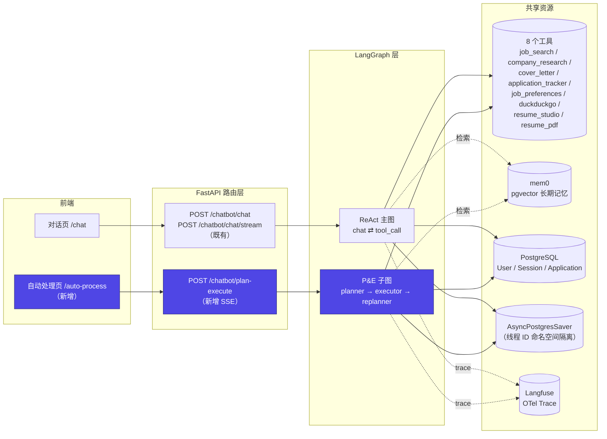
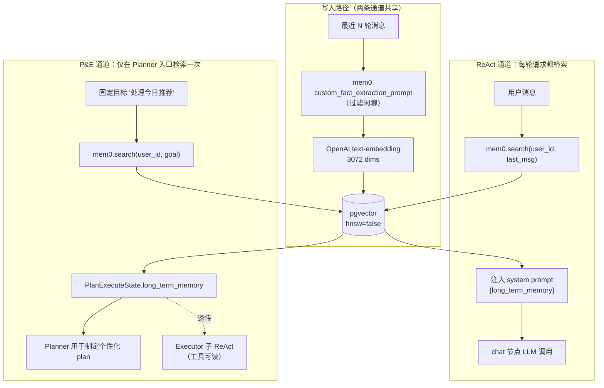
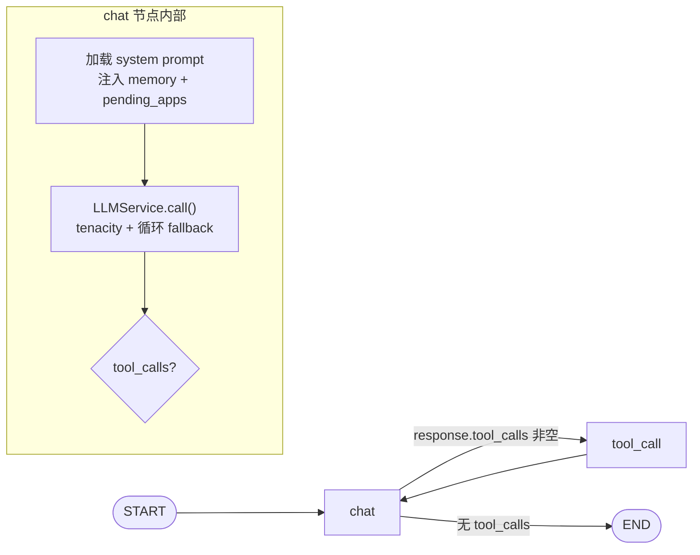
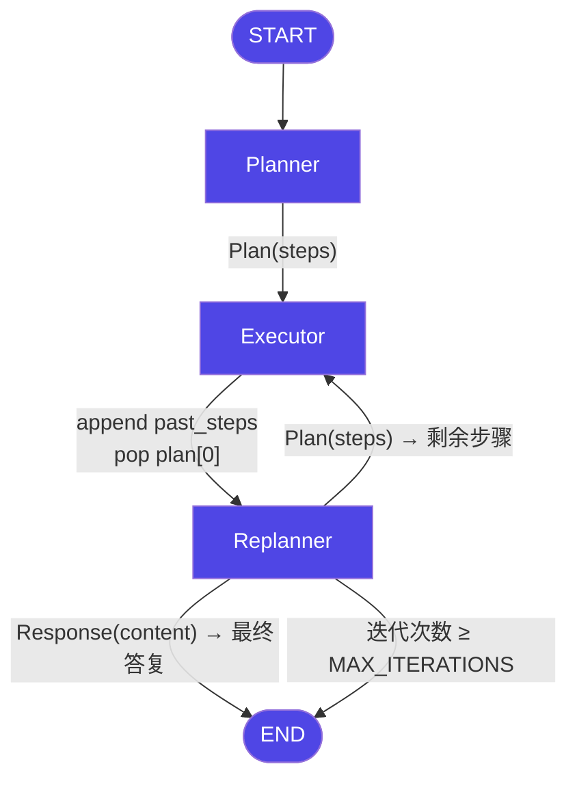
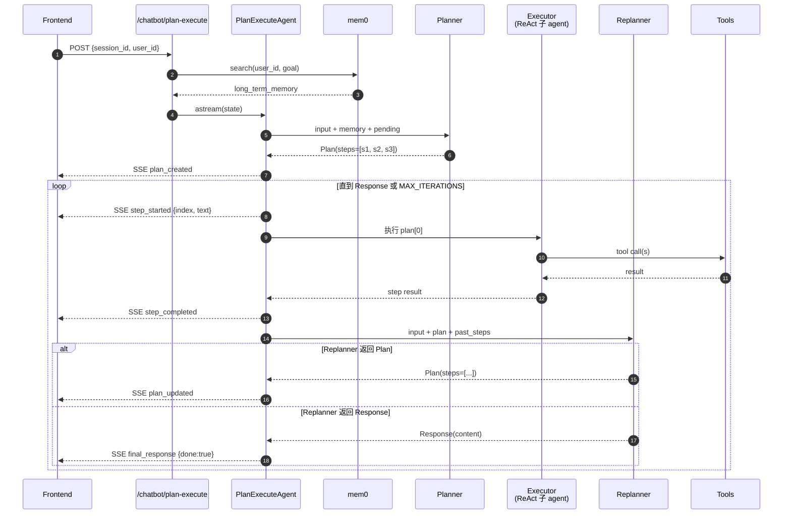

# Plan-and-Execute 子图设计

**日期**：2026-04-15
**状态**：Design（待实施）
**作者**：Claude + 0xMoat
**目标读者**：面试官 / 协作开发者

---

## 1. 背景与目的

本项目是面向**面试演示**的求职 Agent 原型。当前生产代码中的 Agent 主图是经典 ReAct 结构（`chat ⇄ tool_call`），对"单轮对话 + 单步工具调用"场景表现良好，但缺少以下技术叙事面：

- **显式规划**（Planner）与**动态重规划**（Replanner）的分离
- 多步批处理任务的端到端可追溯
- LangGraph 结构化输出（`with_structured_output` + `Union[Response, Plan]`）的经典用法

本设计新增一条独立的 **Plan-and-Execute 子图通道**，承载「一键处理今日推荐职位」这一具备真实业务意义的多步任务，作为面试可讲解的技术亮点。**不替换**现有 ReAct 对话主图——两条通道并存，各司其职。

### 非目标（明确不做）

1. 不改现有 ReAct 主图的行为，对话体验零回归
2. 不做并行执行（官方 P&E 教程是串行的，坚持官方做法）
3. 不做人工审批节点（HITL）
4. 不持久化独立的 P&E 业务表（复用 PG checkpointer，线程 ID 独立即可）
5. 不做跨会话"恢复未完成 plan"——执行崩溃就算失败，重新发起
6. 不做"今日推荐"之外的场景（范围聚焦，面试只讲一个）
7. 不引入新依赖（langgraph / pydantic / langfuse 已足够）

---

## 2. 双通道架构总览

ReAct 与 P&E 作为两条独立的 LangGraph 子图，通过不同的 API 入口对外暴露，共享同一套底层资源（工具集、长期记忆、数据库、观测）。



**职责边界**

| 维度 | ReAct 主通道 | P&E 子通道 |
|---|---|---|
| 场景 | 对话、单步工具调用 | 多步批处理任务 |
| 触发 | 用户对话输入 | 前端按钮 → 独立 API |
| 延迟敏感度 | 高（流式 token） | 中（步骤级进度即可） |
| 规划 | 隐式（LLM 每轮决策） | 显式 Plan + Replan |
| 失败处理 | 消息层抛错 | Replanner 动态决策 |
| 讲解技术点 | StateGraph、流式、tool binding | 结构化输出、Union 路由、past_steps |

---

## 3. 检索增强（Long-term Memory）在两条通道的接入点

项目的"RAG"能力由 **mem0 + pgvector** 提供：对话过程中用户画像/偏好被抽取到向量库，每次请求按 query 语义检索 Top-K，作为 system prompt 片段注入。两条通道都接入同一个 Memory，但注入时机与使用方式不同。



**关键差异**

- **ReAct** 每次用户输入都触发一次 mem0 检索（query = 最新用户消息），契合对话语境漂移
- **P&E** 只在进入子图前检索一次（query = 固定目标语句），结果固化在 `state.long_term_memory`，整个 plan 执行期间复用
- **复用的工具**（如 `cover_letter_tool`）通过 `InjectedState("long_term_memory")` 自动读取当前 state，两条通道对工具透明

---

## 4. ReAct 主通道（既有）关键流程

保留现状，仅作为对照。源码见 `app/core/langgraph/graph.py`。



**特征**
- 单一 `chat` 节点承担"推理 + 决策"
- 工具调用是可选分支，由 LLM 自主判断
- 无显式"任务"概念；对话即状态

---

## 5. P&E 子通道（新增）

### 5.1 图结构



### 5.2 State 定义

```python
class PlanExecuteState(BaseModel):
    input: str                              # 用户目标（固定模板）
    plan: list[str] = []                    # 待执行步骤（自然语言）
    past_steps: list[tuple[str, str]] = []  # (step_text, result) 历史
    response: str | None = None             # 最终回答
    long_term_memory: str = ""              # 一次性检索的用户画像
    pending_applications: str = ""          # 进入子图前快照
    iterations: int = 0                     # 硬护栏计数器
```

### 5.3 节点职责

| 节点 | 输入 | 处理 | 输出 | LLM 调用 |
|---|---|---|---|---|
| **Planner** | input + long_term_memory + pending_applications | `llm.with_structured_output(Plan)` 生成步骤列表 | 更新 `state.plan` | 1 次 |
| **Executor** | `state.plan[0]` + 共享资源 | 启动 `create_react_agent`（绑定 8 个工具）执行单步 | 追加 `past_steps`，从 plan 弹出首项，`iterations += 1` | 1 个子 ReAct 循环（多次 LLM） |
| **Replanner** | input + original plan + past_steps | `llm.with_structured_output(Union[Response, Plan])` | 设 `state.response` 或替换 `state.plan` | 1 次/步 |

### 5.4 Plan / Response Schema（官方做法）

```python
class Plan(BaseModel):
    steps: list[str] = Field(..., description="按顺序执行的步骤，每步一句自然语言指令")

class Response(BaseModel):
    content: str = Field(..., description="给用户的最终答复")

class Act(BaseModel):
    action: Union[Response, Plan] = Field(..., description="返回 Response 以结束；返回 Plan 以替换剩余步骤")
```

### 5.5 一次完整调用的时序



---

## 6. SSE 事件协议

所有事件保留既有基础字段 `{type, content, done}`，前端复用现有 SSE 解析器。

| type | 新增/复用 | payload | 触发时机 |
|---|---|---|---|
| `plan_created` | 新增 | `{steps: list[str]}` | Planner 首次产出 |
| `step_started` | 新增 | `{index, text, total}` | Executor 开始一步 |
| `step_completed` | 新增 | `{index, text, result}` | Executor 完成一步 |
| `plan_updated` | 新增 | `{remaining: list[str], reason?: str}` | Replanner 改写 plan |
| `final_response` | 新增 | `{content, done:true}` | Replanner 返回 Response 或触顶 |
| `tool_call` | 复用 | 同 ReAct | Executor 子 ReAct 触发 |
| `tool_result` | 复用 | 同 ReAct | Executor 子 ReAct 触发 |
| `reasoning_chunk` | 复用 | 同 ReAct | Executor 子 ReAct（DeepSeek 思考） |
| `error` | 复用 | `{message, step_index?}` | 任一节点抛错 |

**嵌套关系**：`tool_call / tool_result / reasoning_chunk` 出现时，前端应归属到**当前 `step_started` 但尚未 `step_completed`** 的步骤卡片内。

---

## 7. 错误处理与护栏

| 环节 | 失败场景 | 策略 |
|---|---|---|
| Planner | 结构化输出失败 / 空 plan / 所有模型 fallback 失败 | 抛 500 → `error` 事件 → 前端提示"无法规划"，**不降级到 ReAct** |
| Executor 单步 | 工具抛错 / 子 ReAct 超时 | 捕获 → `past_steps` 追加 `(step, "FAILED: {reason}")` → 进 Replanner，让 LLM 决策跳过 / 替换 / 终止 |
| Replanner | 结构化输出失败 / 所有模型失败 | 把 `past_steps` 拼成 Markdown 摘要作为 `final_response` 返回（降级） |
| 死循环 | Replan 无限产出新 plan | 硬上限 `MAX_ITERATIONS = 10`，超限强制 END 并附提示 |
| 空 pending | 用户无待处理职位 | API 前置校验 → 直接返回 `final_response: "暂无待处理职位"`，不进子图 |

**原则**：单步失败**不中断**整体流程——Replanner 的存在价值正是"失败驱动的动态规划"，这是 P&E 相对于朴素 Chain 的核心优势，也是面试的核心讲解点。

---

## 8. 前端：`<PlanTimeline>` 组件

- 新页面路由 `/auto-process`
- 对话主页顶部新增入口按钮："一键处理今日推荐"
- 组件结构：
  - 顶部：标题 + 进度条 `已完成 N / 总 M`
  - 主体：竖向时间线，每步一张卡片
    - 状态：`pending | running | done | failed`（映射 4 种视觉）
    - 卡片内嵌 `<ToolCallCard>`（既有）渲染工具调用
  - 底部：`final_response` 渲染区（Markdown）
- `plan_updated` 事件触发 diff 动画：旧步骤淡出、新增步骤滑入

---

## 9. 可观测性

- **OTel Span**：每个节点 `tracer.start_as_current_span`，命名：
  - `plan_execute.planner`
  - `plan_execute.executor.step_{i}`
  - `plan_execute.replanner`
- **Langfuse**：复用既有 `CallbackHandler`，所有 LLM 调用自动串成同一 trace；`metadata.langfuse_session_id` 填新线程 ID
- **结构化日志**（structlog，lowercase_with_underscores）：
  - `plan_execute_started`
  - `plan_generated`（附步骤数）
  - `step_executed`（附耗时、工具列表）
  - `plan_replanned`（附 new_steps_count）
  - `plan_execute_completed`（附 iterations、final_length）
  - `plan_execute_failed`（附 error、phase）

---

## 10. 文件与模块规划

```
app/
├── core/langgraph/
│   ├── graph.py                       # 既有 ReAct，不动
│   └── plan_execute.py                # 新增：PlanExecuteAgent + 子图构建
├── api/v1/
│   └── chatbot.py                     # 新增 /plan-execute 路由
├── schemas/
│   └── plan_execute.py                # 新增：PlanExecuteState / Plan / Response / Act
├── core/prompts/
│   ├── plan_execute_planner.md        # 新增
│   └── plan_execute_replanner.md      # 新增
evals/metrics/prompts/
├── plan_quality.md                    # 新增
└── replan_decision.md                 # 新增
scripts/
└── verify_plan_execute.py             # 新增：CLI 验证脚本
frontend/
├── app/auto-process/page.tsx          # 新增
└── components/plan/
    ├── PlanTimeline.tsx               # 新增
    └── PlanStepCard.tsx               # 新增
```

---

## 11. 测试与验证

仓库约定无 pytest，采用三层验证。

### 11.1 CLI 验证脚本

`scripts/verify_plan_execute.py`：端到端跑一次真实链路，打印所有 SSE 事件到终端，检查任一步 FAILED 即非 0 退出。

### 11.2 手动 E2E Checklist（实施后勾选）

- [ ] 点击入口按钮 → 跳 `/auto-process`
- [ ] `plan_created` 渲染初始清单
- [ ] 步骤状态 pending → running → done 切换正确
- [ ] 工具调用卡片嵌套在对应步骤内
- [ ] 故意注入失败（mock 不存在公司） → `plan_updated` 触发 + diff 动画生效
- [ ] `final_response` Markdown 渲染正确
- [ ] 进度条 100%
- [ ] Langfuse 面板可见完整 trace（planner + executor steps + replanner）
- [ ] 空 pending 用户 → API 直接返回"暂无待处理职位"

### 11.3 Langfuse 在线 Eval

新增两个 `.md` metric prompt，自动被 eval harness 发现：

- `plan_quality.md`：评"初始 plan 是否覆盖目标且步骤原子化"（1-5）
- `replan_decision.md`：评"Replanner 每次决策是否合理"（1-5）

---

## 12. 面试讲解脚本（5-8 分钟版本）

1. **动机**（30s）：对话式 ReAct 无法清晰表达多步任务；面试官要看"Agent 的规划能力"就需要显式 Plan 节点。
2. **架构**（1 min）：两张图，双通道并存 + 共享 RAG/工具/trace。
3. **P&E 核心结构**（2 min）：Planner → Executor → Replanner 闭环；`Union[Response, Plan]` 条件路由是官方模式。
4. **Live Demo**（2 min）：点按钮，PlanTimeline 动态展开；故意留一个失败步骤看 Replanner 动态改写。
5. **观测**（1 min）：打开 Langfuse 展示完整 trace 与在线 eval 分数。
6. **取舍**（1 min）：为什么不替换 ReAct、为什么不做并行、为什么 MAX_ITERATIONS。

---

## 13. 开放问题

暂无——所有方案分歧已在 brainstorming 阶段定稿。实施中若遇新问题回到此文档追加决策记录。
