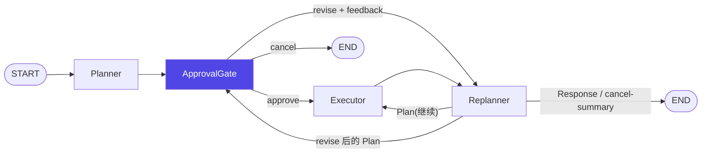
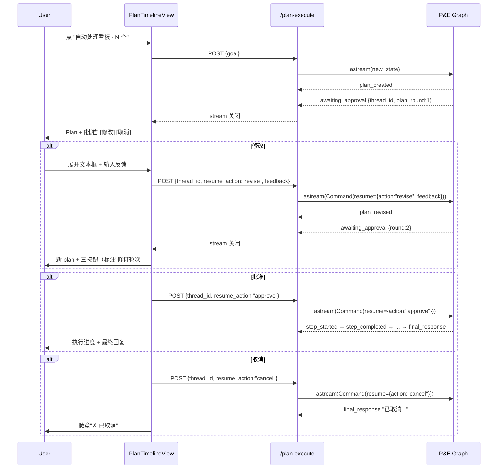

# Plan Approval HITL 设计

**日期**：2026-04-16
**状态**：Design（待实施）
**前置**：`docs/superpowers/specs/2026-04-15-plan-and-execute-design.md`
**目标读者**：面试官 / 协作开发者

---

## 1. 背景与目的

当前 Plan-and-Execute 子图是"全自主"流程——用户点按钮后 Planner 立刻产出计划、Executor 立刻开跑。本设计在 **Planner 与 Executor 之间**插入一个 Human-in-the-loop 审批门，让用户：

1. 看到 Planner 生成的计划
2. 选择 **批准 / 修改 / 取消**
3. 选"修改"时用自然语言反馈，Replanner 基于反馈重写 plan，再次审批（可多轮）
4. 选"批准"后 Executor 全自主跑到结束

这把 P&E 模式升级为 **"LLM 规划 + 人类把关 + 反馈驱动重规划 + Agent 自主执行"**，是 LangGraph 官方教程的经典 HITL 场景。

### 非目标（明确不做）

1. ❌ Replanner 中途每次改 plan 的二次确认（HITL 只在 Planner 后）
2. ❌ 工具级二次确认（敏感工具执行前）
3. ❌ 结构化 plan 编辑 UI（拖拽/行内编辑），只支持文本反馈
4. ❌ 超时机制（待批准的 thread 在 checkpoint 中永存）
5. ❌ `/plan-execute/history` 或全局 pending approvals API
6. ❌ 不改 ReAct 主对话通道，只在 P&E 流上加 HITL
7. ❌ 不加并发保护（同一 thread 并发 resume 的 race 交给 LangGraph）

---

## 2. 架构变化

### 2.1 图结构

插入 `approval_gate` 节点：



### 2.2 approval_gate 节点职责

- 在内部调 `interrupt()`——LangGraph 暂停图，checkpointer 把整个 state 持久化到 PG
- `interrupt()` 返回前由 astream 层 emit `awaiting_approval` SSE 事件携带 `thread_id + plan + round`
- resume 时 LangGraph 把 `Command(resume=payload)` 注入，approval_gate 读 `payload.action` 决策：
  - `approve` → 节点返回 `{}`（state 不变），走边到 `executor`
  - `cancel` → 返回 `{"response": "已取消..."}`，走边到 END
  - `revise` → 返回 `{"user_feedback": payload.feedback, "approval_round": round+1}`，走边到 `replanner`

### 2.3 Replanner 节点改造

- 读 `state.user_feedback`：若非空，system prompt 里注入 `## 用户反馈\n{user_feedback}`
- 处理完把 `user_feedback` 置 `None`（防止下轮污染）
- 产出的 Plan 通过 `state.plan` 写回，由条件边送回 `approval_gate`（revise 场景）或 `executor`（正常 replan 场景）
- **如何区分两种场景**：在 state 里加 `pending_revise: bool`，approval_gate 处理 revise 时设为 True；Replanner 根据该 flag 决定下一站（通过 state 写 `route_hint` 或直接用条件边读 flag）

### 2.4 条件路由更新

`approval_gate` 出边：
```python
builder.add_conditional_edges(
    "approval_gate",
    self._route_after_approval,    # reads state.user_feedback + state.response
    ["executor", "replanner", END],
)
```

`replanner` 出边（扩展现有 `_should_end`）：
```python
# 新增分支：pending_revise=True 时送回 approval_gate
```

---

## 3. thread_id 策略

| 场景 | thread_id 来源 | 原因 |
|---|---|---|
| 用户首次点"自动处理" | 后端生成 `pe_<session>_<uuid8>` | 每次启动新独立 run |
| 用户点 批准/修改/取消 | 前端带来自上次 SSE 的 thread_id | 必须精确 resume 同一 run |
| 用户 HITL 挂起后又点"自动处理" | 后端生成**新的** `pe_<session>_<uuid8>` | 放弃旧 run，开始新 run（旧 thread 残留 checkpoint 但不可达） |

---

## 4. SSE 事件协议

### 4.1 新增事件

| type | payload | 何时发 |
|---|---|---|
| `awaiting_approval` | `{thread_id, plan: [{id, text}], round: int, done: true}` | approval_gate 内 interrupt 时 |
| `plan_revised` | `{plan: [{id, text}], reason: "user_feedback", done: false}` | Replanner 基于 feedback 产出新 plan 后（随后紧跟 `awaiting_approval`） |

### 4.2 现有事件（不变）

`plan_created` / `step_started` / `step_completed` / `plan_updated` / `final_response` / `error`

### 4.3 stream 生命周期（每次 HTTP 请求一条 SSE）

```
启动：
  plan_created → awaiting_approval(done:true) → 流关闭

Approve resume：
  (可选空事件) → step_* 系列 → final_response(done:true) → 流关闭

Revise resume：
  plan_revised → awaiting_approval(round+1, done:true) → 流关闭

Cancel resume：
  final_response(done:true, content="已取消...") → 流关闭
```

注意 `awaiting_approval` 的 `done:true`——流立刻关闭等人。前端据此知道"这次 HTTP 结束，继续需要再发请求"。

---

## 5. API 变化

### 5.1 `/api/v1/chatbot/plan-execute` 请求体

```python
class PlanExecuteRequest(BaseModel):
    goal: str = "处理看板上所有状态为 pending 的职位..."
    thread_id: Optional[str] = None       # 有 = resume; 无 = 新启动
    resume_action: Optional[Literal["approve", "revise", "cancel"]] = None
    feedback: Optional[str] = None        # 仅 revise 时必须
```

### 5.2 astream 分支

```python
if body.thread_id:
    # resume 模式：用给定 thread_id，跳过 mem0 / pending 预取
    # graph.astream(Command(resume={action, feedback}), config_with_thread)
else:
    # 新启动模式：生成 thread_id + 预取 memory/pending + 初始化 state
```

---

## 6. State / 视图模型扩展

### 6.1 后端 `PlanExecuteState`

```python
class PlanExecuteState(BaseModel):
    # ── 既有字段不变 ──
    input: str
    plan: list[str] = []
    past_steps: list[tuple[str, str]] = []
    response: str | None = None
    long_term_memory: str = ""
    pending_applications: str = ""
    iterations: int = 0
    # ── HITL 新增 ──
    user_feedback: str | None = None      # revise 时用户输入
    approval_round: int = 0               # 第几轮审批
    pending_revise: bool = False          # 路由 hint：Replanner 应回 approval_gate
```

### 6.2 前端 `PlanExecuteView`

```typescript
export interface PlanExecuteView {
  steps: PlanStep[]
  finalResponse: string | null
  errorMsg: string | null
  running: boolean
  // ── HITL 新增 ──
  threadId: string | null               // 来自 awaiting_approval
  awaitingApproval: boolean             // 渲染审批 UI 的开关
  approvalRound: number
  revisionReason: string | null         // "基于你的反馈更新"
  cancelled: boolean                    // 取消后的终态徽章
}
```

---

## 7. 两层持久化

| 层 | 存什么 | 作用 |
|---|---|---|
| **PostgreSQL Checkpointer**（后端，权威） | LangGraph 全部 Agent 状态：plan、past_steps、user_feedback、approval_round、interrupt 挂起位置 | resume 的真正依据；换设备/跨进程恢复 |
| **localStorage**（前端，UI 视图缓存） | ChatMessage（含 planExecute steps、finalResponse、threadId、awaitingApproval） | 刷新页面立刻看到气泡，无需阻塞等后端 |

### 7.1 localStorage 缓存规则更新

现有 `savePlanExecuteCache` 过滤 `!running`。改为：

```typescript
const toCache = messages.filter(
  (m) => m.planExecute && (!m.planExecute.running || m.planExecute.awaitingApproval),
)
```

`awaitingApproval` 被视为终态——流已关闭，在等人，值得持久化。

### 7.2 为什么不把 P&E 气泡存到后端表

- 现有 `/chatbot/messages` 只遍历 ReAct 图的 message 列表
- 要加接口需反向工程 LangGraph checkpoint blob 或加 `plan_execute_runs` 表
- 演示不需要（localStorage 已解决刷新场景）
- 权衡交代清楚：生产环境应加独立业务表

---

## 8. 前端交互流程



---

## 9. UI 规范

### 9.1 审批态气泡（awaitingApproval=true）

```
┌──────────────────────────────────────────────┐
│ ⏸ 等你确认 · 第 1 轮                         │
├──────────────────────────────────────────────┤
│ Planner 提出的计划：                         │
│   ○ Step 1  调研蚂蚁集团...                  │
│   ○ Step 2  调研腾讯...                      │
│   ○ Step 3  为蚂蚁集团写求职信                │
├──────────────────────────────────────────────┤
│ [✓ 批准执行]  [✎ 提修改意见]  [✗ 取消]      │
└──────────────────────────────────────────────┘
```

### 9.2 "修改"展开态

```
┌──────────────────────────────────────────────┐
│ 告诉 Planner 要改什么：                      │
│ ┌──────────────────────────────────────────┐ │
│ │ 不要调研蚂蚁集团，直接写信                │ │
│ └──────────────────────────────────────────┘ │
│                   [返回]  [提交反馈]         │
└──────────────────────────────────────────────┘
```

### 9.3 状态徽章矩阵

| 状态 | 徽章 | 颜色 |
|---|---|---|
| running | `● 处理中…` | indigo-100 + pulse |
| awaitingApproval | `⏸ 等你确认` | indigo-200 + pulse |
| revisionReason | （轮次标签）`修订轮次 #2` | 同"等你确认"并列显示 |
| finalResponse | `✓ 已完成` | emerald-100 |
| cancelled | `✗ 已取消` | zinc-300 |
| errorMsg | `⚠ 出错` | rose-100 |

---

## 10. 错误处理

| 场景 | 处理 |
|---|---|
| resume 请求带不存在的 thread_id | API 返回 404 `{error: "thread not found"}`，前端显示"审批已过期，请重新发起" |
| resume 请求少了 feedback（revise 动作） | API 返回 400 `{error: "feedback required for revise"}` |
| LangGraph interrupt 被触发但 astream 迭代器忽略 Command | 检测 `__interrupt__` 特殊值，emit `awaiting_approval` 并 return |
| Replanner 在 revise 场景失败走 fallback | fallback 写 `response = summary + "由于 replan 失败已终止"`，走 END（不再循环审批） |
| 并发 resume 同一 thread_id | LangGraph checkpointer 用最后一次写入；后到的请求若 state 已终止则 400 |

---

## 11. 文件与模块改动规划

```
app/
├── schemas/plan_execute.py                # [改] PlanExecuteState 加 3 字段
├── core/prompts/plan_execute_replanner.md # [改] 加"若有用户反馈，优先据此调整"段落
├── core/langgraph/plan_execute.py         # [改]
│   ├── 新增 _approval_gate 节点
│   ├── 新增 _route_after_approval 条件函数
│   ├── _replan 处理 user_feedback + 设置 pending_revise
│   ├── _should_end 扩展：pending_revise=True → 回 approval_gate
│   └── astream 分支：新启动 vs resume
├── api/v1/chatbot.py                      # [改] PlanExecuteRequest 加字段 + 路由分支
frontend/
├── lib/types.ts                           # [改] PlanExecuteView 加字段，PlanStreamChunk 加两种
├── lib/api.ts                             # [改] startPlanExecute 接受 resume 参数
├── hooks/useChat.ts                       # [改] 新增 resumePlanExecute；启动 SSE 识别 awaiting_approval/plan_revised；cache 规则加 awaitingApproval
├── components/plan/PlanTimeline.tsx       # [改] awaiting_approval 区块 + 按钮 + 文本框
└── components/plan/PlanApprovalCard.tsx   # [新] 审批面板组件（按钮 + 修改文本框）
```

---

## 12. 测试与验证

仓库约定无 pytest。沿用现有验证层级：

### 12.1 手动 E2E checklist

- [ ] 正常流程：启动 → 看到待审批 plan → 点批准 → 执行完成
- [ ] 修改闭环：启动 → 修改（"不要 X"）→ 新 plan 不含 X → 再批准 → 执行完成
- [ ] 多轮修订：连续修改 2-3 次，approval_round 正确递增
- [ ] 取消：启动 → 取消 → 徽章"已取消"
- [ ] 刷新恢复：待审批状态下刷新页面 → 气泡恢复 → 按钮仍可点
- [ ] 旧 thread 失效：挂起审批后重新点"自动处理看板" → 开新 thread，旧气泡保留为"已取消"或继续显示（前端自行决定）
- [ ] 错误路径：伪造 thread_id 触发 404，UI 显示"审批已过期"

### 12.2 Langfuse 可观测

- 每轮审批在 trace 中可见完整 `planner → interrupt → replanner (revise)` 链路
- `approval_round` 出现在 trace metadata

### 12.3 Eval 指标

现有 `plan_quality` 和 `replan_decision` 都适用，无需修改。Plan 质量评 Planner 首次输出；Replan decision 评 Replanner 在 revise 场景下根据 feedback 调整的合理性。

---

## 13. 简历价值（核心交付指标）

实施后简历可新增 bullet：

> Plan-and-Execute 子图集成 LangGraph **`interrupt()` + Postgres Checkpointer** 实现 **Plan 审批 HITL**：Planner 产出计划后图暂停落盘，Chat 气泡展示批准/修改/取消；用户反馈经 Replanner 重写 plan 后 `Command(resume)` 恢复执行，兼顾 Agent 自主性与人工监督，多轮审批闭环。

面试追问点：
- **"怎么跨 HTTP 请求恢复图状态？"** → PG checkpointer 存 snapshot + interrupt 挂起点，第二次 astream 用同 thread_id + `Command(resume)` 恢复
- **"前端怎么知道在等人？"** → SSE `awaiting_approval` 事件 `done:true`，前端 state 切换到 approval 态
- **"用户反馈怎么影响 plan？"** → 写入 `state.user_feedback`，Replanner prompt 注入该字段，LLM 据此改写

---

## 14. 开放问题

暂无——所有设计决策已在 brainstorming 阶段敲定。
