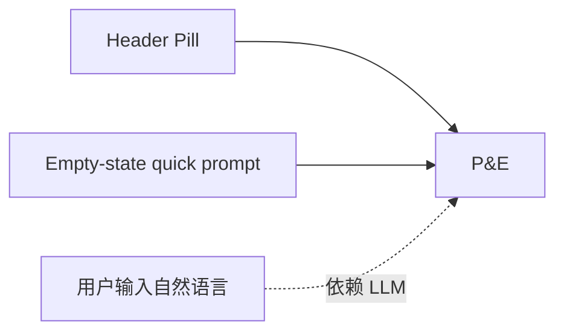
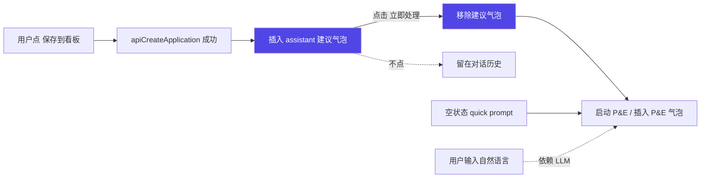
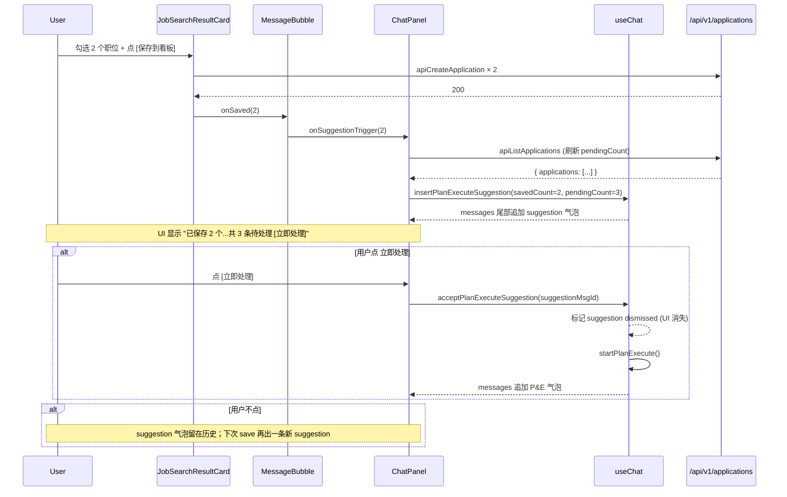

# Save-to-PE Suggestion Bubble 设计

**日期**：2026-04-16
**状态**：Design（待实施）
**前置**：
- `docs/superpowers/specs/2026-04-15-plan-and-execute-design.md`
- `docs/superpowers/specs/2026-04-16-plan-approval-hitl-design.md`
**目标读者**：面试官 / 协作开发者

---

## 1. 背景与目的

当前 Plan-and-Execute 有三个入口：
1. Chat header 的紫色 pill `自动处理看板 · N 个`（一直显示，视觉杂音大）
2. 空状态的 quick prompt 区同款按钮
3. 对话输入框自然语言触发（依赖 agent 识别，非 deterministic）

问题：
- Header pill 占固定 UI 位置，与 Agent 气质割裂（Agent 产品不应该有"永久工具栏"）
- 用户"保存职位到看板"这个**最天然的 P&E 触发时机**完全未被利用
- 批量保存后用户要自己知道去点按钮才能触发自动处理

本设计用 **"save 动作 → Agent 主动建议"** 的交互替代常驻按钮：

```
用户点 [保存到看板] → 后端保存成功
                    → 前端插入一条 assistant 气泡：
                      "已保存 N 个职位到看板，要我现在帮你自动处理吗？[✓ 立即处理]"
                    → 点立即处理 → 该气泡被 P&E 执行气泡替代
                    → 不点 → 气泡留在对话历史，无副作用
```

### 非目标

1. ❌ 不做"稍后再说"按钮（不点即等于忽略，气泡留痕）
2. ❌ 不做"已拒绝"状态管理
3. ❌ 不做"会话内只提一次"去重（Q1：每次 save 都提）
4. ❌ 不做 LLM 驱动的建议（不让 ReAct agent 自己判断要不要提，保持 deterministic）
5. ❌ 不改后端 API 协议（save API 无需新增字段）
6. ❌ 不做阈值判断（save 1 条也提；用户自己看着办）

---

## 2. 架构变化

### 2.1 现状（P&E 触发入口）



### 2.2 设计后



**变化总结**：
- Header pill 删除
- 空状态 quick prompt 保留（新手 discoverability）
- 新增 **save → suggestion bubble → P&E** 路径（主要入口）

---

## 3. ChatMessage 类型扩展

现有 `ChatMessage` 是 user / assistant 两类，assistant 可能带 planExecute 字段。

**新增一种 assistant 消息形态**：`planExecuteSuggestion`

### 3.1 前端类型

```typescript
export interface PlanExecuteSuggestion {
  savedCount: number      // 这次保存了几条
  pendingCount: number    // 保存后看板 pending 总数（用于文案"共 M 条待处理"）
  dismissed: boolean      // 用户已点"立即处理"→ 标记为 dismissed，UI 不再渲染
}

export interface ChatMessage {
  id: string
  role: MessageRole
  textContent: string
  toolCalls: ToolCallEntry[]
  thinking?: ThinkingEntry
  timestamp?: Date
  planExecute?: PlanExecuteView
  planExecuteSuggestion?: PlanExecuteSuggestion   // 新增
}
```

- `dismissed` 字段的作用：点"立即处理"后，下一帧插入 P&E 气泡同时把 suggestion 气泡的 `dismissed` 置 true，**MessageBubble 看到 dismissed=true 就不渲染**。保留在 messages 数组仅为"历史记录"连续性（React key 稳定），避免删除动画突兀。
- 不加新 `role`（保持 ChatMessage 现有类型体系简单），靠 `planExecuteSuggestion` 字段做 discriminator。

### 3.2 持久化

- 普通的非 dismissed suggestion 气泡**写入** localStorage，和 planExecute 气泡一起作为终态缓存
- dismissed 的 suggestion 气泡不保存（filter 掉）—— 刷新后就消失，视觉干净

---

## 4. 触发点：保存到看板

当前 `JobSearchResultCard` 组件里有"保存到看板"按钮。成功保存后需要通知上级。

### 4.1 Props / 回调

`JobSearchResultCard` 新增可选 prop：
```typescript
interface JobSearchResultCardProps {
  entry: ToolCallEntry
  onSaved?: (savedCount: number) => void
}
```

成功保存 N 条后调用 `onSaved(N)`。

### 4.2 传递链

- `MessageBubble` 渲染 `<JobSearchResultCard entry={tc} onSaved={onSuggestionTrigger} />`
- `MessageBubble` 接受新 prop `onSuggestionTrigger?: (savedCount: number) => void`
- `ChatPanel` 实现 handler：拿到 `savedCount` → 查当前 pending 总数 → 调 `useChat.insertPlanExecuteSuggestion(savedCount, pendingCount)`

### 4.3 pendingCount 怎么拿

已存在 `apiListApplications(token)`。ChatPanel 已经为 header pill 缓存了 pendingCount（之后 header pill 虽然被删除了，这个 effect 保留），每次 save 后：
- 重新拉一次 pending count
- 或：save API 返回时本地 +1（但我们不想改后端，也不想重复计数）→ 直接拉一次最准

---

## 5. useChat 新方法

### 5.1 `insertPlanExecuteSuggestion`

```typescript
const insertPlanExecuteSuggestion = useCallback(
  (savedCount: number, pendingCount: number) => {
    setMessages((prev) => [
      ...prev,
      {
        id: makeId(),
        role: "assistant",
        textContent: "",
        toolCalls: [],
        timestamp: new Date(),
        planExecuteSuggestion: {
          savedCount,
          pendingCount,
          dismissed: false,
        },
      },
    ])
  },
  [],
)
```

### 5.2 `acceptPlanExecuteSuggestion`

```typescript
const acceptPlanExecuteSuggestion = useCallback(
  async (suggestionMsgId: string) => {
    // Mark suggestion dismissed (won't render, won't cache).
    setMessages((prev) =>
      prev.map((m) =>
        m.id === suggestionMsgId && m.planExecuteSuggestion
          ? { ...m, planExecuteSuggestion: { ...m.planExecuteSuggestion, dismissed: true } }
          : m,
      ),
    )
    // Kick off the normal P&E flow. It appends its own planExecute bubble.
    await startPlanExecute()
  },
  [startPlanExecute],
)
```

### 5.3 导出

```typescript
return {
  messages,
  streaming,
  error,
  historyLoading,
  sendMessage,
  startPlanExecute,
  resumePlanExecute,
  insertPlanExecuteSuggestion,      // new
  acceptPlanExecuteSuggestion,      // new
  clearMessages,
}
```

---

## 6. UI 组件

### 6.1 新组件 `PlanExecuteSuggestionCard`

```
┌──────────────────────────────────────────────┐
│ 💼 已保存 2 个职位到看板，共 3 条待处理      │
│                                              │
│                  [✓ 立即处理]                │
└──────────────────────────────────────────────┘
```

**Props**：
```typescript
interface PlanExecuteSuggestionCardProps {
  suggestion: PlanExecuteSuggestion
  onAccept: () => void
  disabled?: boolean
}
```

**渲染规则**：`suggestion.dismissed === true` 时返回 `null`（不渲染）。

### 6.2 MessageBubble 集成

```typescript
// 新增分支：在文本 / planExecute 渲染分支外，再加一个
if (message.planExecuteSuggestion) {
  return <PlanExecuteSuggestionCard ... />
}
```

### 6.3 ChatPanel 的 header 改动

- 删除 header 的 P&E pill（line ~46-56 那块 `<button>自动处理看板 · N 个</button>`）
- `pendingCount` effect 保留（空状态 quick prompt 仍需要，且 save 回调要读最新值）
- 空状态 quick prompt 里的按钮保留（Q2 决定）

---

## 7. 数据流时序



---

## 8. 持久化规则

`savePlanExecuteCache` 现在缓存带 `planExecute` 的消息；扩展为也缓存 suggestion：

```typescript
const toCache = messages.filter((m) => {
  if (m.planExecute && !m.planExecute.running) return true
  if (m.planExecuteSuggestion && !m.planExecuteSuggestion.dismissed) return true
  return false
})
```

`loadPlanExecuteCache` 不变（现有 `new Date(m.timestamp)` revive 逻辑对 suggestion 也生效）。

---

## 9. 错误处理

| 场景 | 策略 |
|---|---|
| save API 失败 | 不触发 suggestion（JobSearchResultCard 原有 error 提示不变） |
| `apiListApplications` 失败 | 降级：pendingCount = savedCount（至少这次刚保存的数量） |
| 用户点 [立即处理] 但 pending 已全被处理（比如其他 tab 清空） | P&E 入口 astream 的空 pending 短路已处理，会显示"暂无待处理" final_response |
| 连续 save 触发多个 suggestion 气泡 | 都正常插入，按时间排列，各自独立（符合 Q1 "每次 save 都提"） |

---

## 10. 文件与模块改动规划

```
frontend/
├── lib/types.ts                                # [改] 加 PlanExecuteSuggestion + ChatMessage 字段
├── hooks/useChat.ts                            # [改] 新增 2 方法 + cache 规则扩展
├── components/plan/PlanExecuteSuggestionCard.tsx  # [新]
├── components/chat/JobSearchResultCard.tsx     # [改] onSaved 回调
├── components/chat/MessageBubble.tsx           # [改] suggestion 分支 + onSuggestionTrigger prop
└── components/chat/ChatPanel.tsx               # [改] 删 header pill + save 回调串联
```

---

## 11. 测试与验证

仓库约定无 pytest。沿用：

### 11.1 手动 E2E checklist

- [ ] Header pill 已消失
- [ ] 新对话空状态的 quick prompt 里仍有"自动处理看板 · N 个"按钮
- [ ] 搜索职位后，勾选 N 条 → 点"保存到看板" → 对话流底部出现"已保存 N 个职位..."气泡 + [立即处理] 按钮
- [ ] 点"立即处理" → suggestion 气泡消失 + P&E 气泡接替开始执行
- [ ] 连续 save 2 次 → 出 2 条独立 suggestion 气泡
- [ ] 刷新页面 → 未点击的 suggestion 气泡仍在；已 dismissed 的不再出现
- [ ] save 失败（临时切掉 API）→ 无 suggestion 气泡插入
- [ ] 保存 0 条（勾选为空）→ 无气泡（业务上已禁止）

---

## 12. 简历价值

实施后可以把"Agent 主动建议"作为亮点写入：

> 在"保存到看板"动作后自动插入 assistant 建议气泡提示"N 个职位已保存，要自动处理吗？"，点击即触发 Plan-and-Execute 子图——把 Agent 的主动性从静态按钮迁移到行为感知式交互。

面试追问点：
- "为什么不让 LLM 决定什么时候建议？"→ 答："deterministic，保证每次 save 都触发，不受 LLM 状态波动影响；本质是产品层规则，不是 Agent 推理决策"
- "为什么不加 dismiss / 稍后按钮？"→ 答："最小状态机原则，不点即默认忽略，减少决策负担"

---

## 13. 开放问题

暂无。
