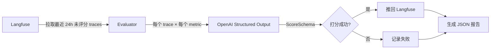
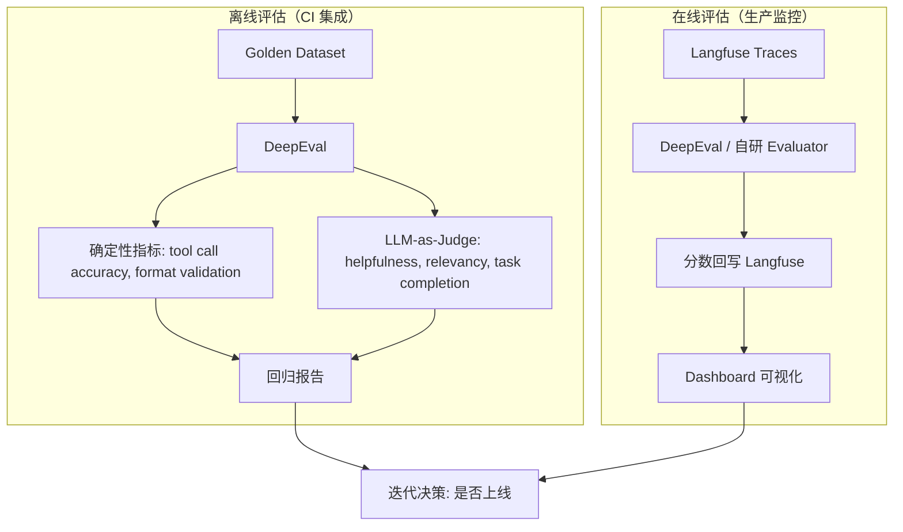

# Agent 评估体系指南

本文档总结了 LLM/Agent 评估领域的工业实践，分析了当前项目评估体系的现状，并提出针对性的改进建议。

## 目录

- [工业界评估现状](#工业界评估现状)
- [主流评估框架对比](#主流评估框架对比)
- [当前项目评估体系分析](#当前项目评估体系分析)
- [改进建议](#改进建议)

---

## 工业界评估现状

### 没有统一标准

LLM/Agent 评估领域目前**没有统一的行业标准**，原因包括：

- **任务相关性** — Agent 的评估本质上依赖具体场景，求职 Agent 和客服 Agent 的"好"完全不同
- **缺少公认 benchmark** — 不像传统 NLP 有 GLUE/SuperGLUE，Agent 领域的 benchmark（SWE-bench、WebArena、GAIA）各自覆盖不同能力，互相不可比
- **评估方法本身不可靠** — LLM-as-Judge 的结果与 judge 模型、prompt 写法、温度参数高度相关
- **标准持续漂移** — 半年前"不幻觉"就算好，现在要求 Agent 能可靠完成多步任务

### 正在收敛的共识

虽然没有统一标准，工业界在方法论层面逐渐形成了一些共识：

#### 分层评估体系

```
离线评估（开发阶段）
├── Unit evals     — 单组件：检索准确率、工具调用正确率
├── Scenario evals — 端到端：给定场景，任务是否完成
└── Regression     — Golden dataset，防止迭代退化

在线评估（生产阶段）
├── LLM-as-Judge   — 实时评分
├── 隐式信号       — 用户是否重试、是否放弃、会话长度
└── 人工抽检       — 定期标注，校准自动评估的偏差
```

#### 评估维度层级

```
Level 1: 组件级（Retrieval precision/recall, Tool call accuracy）
Level 2: 回合级（单轮回答质量）
Level 3: 任务级（多轮对话后任务是否完成）
Level 4: 系统级（端到端成功率、用户满意度、A/B test）
```

#### 组合评估方法

```
确定性指标（不需要 LLM）
├── Exact match / F1（有标准答案时）
├── Tool call accuracy（agent 场景：调对了吗？参数对了吗？）
├── Regex / JSON schema validation（格式合规性）
└── Latency, token count, cost

LLM-as-Judge（适合主观质量评估）
├── Pointwise scoring（单独打分，最简单）
├── Pairwise comparison（A vs B 哪个好，更可靠）
└── Reference-guided（给标准答案让 judge 对比）

人工评估（金标准）
├── 定期抽样人工标注
└── 用于校准 LLM judge 的准确性
```

### LLM-as-Judge 已知问题

| 问题 | 描述 | 工业界应对 |
|------|------|-----------|
| Position bias | LLM 倾向给排在前面的内容更高分 | 做 pairwise comparison 而非单独打分 |
| Self-enhancement bias | 同系模型互评分数虚高 | 用不同模型家族做 judge |
| Score calibration | 0-1 分数缺乏锚定 | 用 reference-based 评分或 few-shot 校准 |
| 单 judge 不可靠 | 单次调用方差大 | 多次评估取均值，或多个 judge 投票 |

---

## 主流评估框架对比

### RAGAS

**定位：** RAG（Retrieval Augmented Generation）管线专用评估框架。

**核心指标：**

```
用户问题 → [检索环节] → 检索到的上下文 → [生成环节] → 最终回答

检索质量：
  ├── Context Precision  — 检索到的内容里，多少是真正相关的
  └── Context Recall     — 应该检索到的内容，是否都检索到了

生成质量：
  ├── Faithfulness       — 回答是否忠于检索到的上下文（不编造）
  └── Answer Relevancy   — 回答是否切题
```

**适用场景：** 有明确检索环节的 RAG 应用（如文档问答、知识库检索）。

**不适用场景：** 非 RAG 架构的 Agent 系统。RAGAS 要求每个评估用例必须提供 `contexts`（检索到的文档块），没有检索管线的 Agent 无法提供这一中间产物。

### DeepEval

**定位：** 通用 LLM/Agent 评估开源库。

**核心优势：**
- 14+ 内置指标（含 hallucination、faithfulness、tool correctness 等）
- 内置多次评估取均值、置信区间
- 支持 golden dataset + pytest 集成，可跑 CI 回归
- 框架无关，不绑定特定追踪平台
- 完全开源免费，本地运行

**基本用法：**

```python
from deepeval import evaluate
from deepeval.test_case import LLMTestCase
from deepeval.metrics import HallucinationMetric, AnswerRelevancyMetric

test_case = LLMTestCase(
    input="帮我写一封求职信",
    actual_output=agent_output,
    context=retrieved_context  # 可选
)

evaluate(
    test_cases=[test_case],
    metrics=[HallucinationMetric(), AnswerRelevancyMetric()]
)
```

### LangSmith Evaluations

**定位：** LangChain 生态的追踪 + 评估 + Prompt 管理全套平台。

**定价：**

| 计划 | 价格 | Traces | 备注 |
|------|------|--------|------|
| Developer | 免费 | 5k traces/月 | 仅 1 人，功能受限 |
| Plus | $39/seat/月 | 50k traces/月 | 超出按量付费 |
| Enterprise | 联系销售 | 不限 | SSO、SLA 等 |

### 三者对比

| 维度 | RAGAS | DeepEval | LangSmith |
|------|-------|----------|-----------|
| **定位** | RAG 专用评估 | 通用 LLM/Agent 评估库 | 追踪 + 评估 + Prompt 管理平台 |
| **开源** | 是 | 是 | 追踪开源，平台收费 |
| **核心场景** | 有检索环节的 RAG 应用 | 任意 LLM 应用，Agent 友好 | LangChain 生态深度用户 |
| **与 Langfuse 兼容** | 可以共存 | 可以共存 | 功能冲突（追踪重叠） |
| **本项目适用性** | 不适合（非 RAG 架构） | **最适合** | 和 Langfuse 重叠，不推荐 |

---

## 当前项目评估体系分析

### 现有架构

```
evals/
├── main.py            # CLI 入口（交互/快速/无报告三种模式）
├── evaluator.py       # 核心评估器（OpenAI structured output 做 LLM-as-Judge）
├── helpers.py         # 报告生成、分数统计辅助函数
├── schemas.py         # ScoreSchema（score: 0-1, reasoning: str）
└── metrics/
    ├── __init__.py    # 自动发现 prompts/ 下的 .md 文件
    └── prompts/
        ├── conciseness.md
        ├── hallucination.md
        ├── helpfulness.md
        ├── relevancy.md
        └── toxicity.md
```

### 评估流程



### 现有 5 个评估维度

| 维度 | 说明 | 评估层级 |
|------|------|---------|
| conciseness | 回答是否简洁，不冗余 | Level 2（回合级） |
| hallucination | 是否包含虚假或误导信息 | Level 2（回合级） |
| helpfulness | 是否有效解决用户问题 | Level 2（回合级） |
| relevancy | 是否切题，不跑偏 | Level 2（回合级） |
| toxicity | 是否包含有害或冒犯性内容 | Level 2（回合级） |

### 现有体系的优点

- Langfuse 集成完善，分数自动回写，可在 dashboard 可视化
- Metric prompts 自动发现机制，添加新维度只需加 `.md` 文件
- 支持多种运行模式（交互/快速/静默）
- Structured output 保证评分格式一致

### 现有体系的不足

| 问题 | 分析 |
|------|------|
| **维度偏"通用 chatbot"** | 5 个维度全部是回合级文本质量评估，缺少 Agent 特有的 tool calling 准确率、任务完成率 |
| **只覆盖 Level 2** | 没有组件级（Level 1）和任务级（Level 3）评估 |
| **无 Golden Dataset** | 只评线上 traces，没有可控的回归测试用例，无法检测迭代退化 |
| **单 judge 无方差控制** | 每个 metric 只调用一次 LLM，结果方差大 |
| **无确定性指标** | 全部依赖 LLM 打分，没有 exact match、tool call accuracy 等确定性校验 |
| **重试机制用 sleep 而非 tenacity** | `evaluator.py` 中的重试逻辑未遵循项目约定的 tenacity 模式 |

---

## 改进建议

### 优先级排序

按投入产出比排序，建议分三个阶段推进：

### Phase 1: 引入 DeepEval + Golden Dataset（高优先级）

**目标：** 建立可重复的回归测试能力。

**1. 用 DeepEval 替换自研评估逻辑**

保留 Langfuse 做追踪，用 DeepEval 替换 `evals/` 中的自研评估：

```python
# evals/test_golden.py
import pytest
from deepeval import assert_test
from deepeval.test_case import LLMTestCase
from deepeval.metrics import (
    HallucinationMetric,
    AnswerRelevancyMetric,
    GEval,  # 自定义 metric
)

# 自定义 Agent 特有指标
task_completion = GEval(
    name="Task Completion",
    criteria="Evaluate whether the agent successfully completed the user's job-hunting task",
    evaluation_steps=[
        "Identify the user's specific request (resume writing, job search, etc.)",
        "Check if the agent's response directly addresses and completes the task",
        "Score 1.0 if fully completed, 0.5 if partially, 0.0 if not addressed",
    ],
)

@pytest.mark.parametrize("test_case", golden_dataset)
def test_agent_output(test_case):
    assert_test(test_case, metrics=[
        HallucinationMetric(),
        AnswerRelevancyMetric(),
        task_completion,
    ])
```

**2. 建立 Golden Dataset**

准备 20-50 个典型求职场景的测试用例：

```python
# evals/golden_dataset.py
golden_dataset = [
    LLMTestCase(
        input="帮我写一封投递 Google SWE 岗位的求职信",
        expected_output="一封包含技术背景、项目经验、岗位匹配度的求职信",
        context=["用户简历信息", "Google SWE 岗位 JD"],
    ),
    LLMTestCase(
        input="分析一下这个 JD 的关键要求",
        expected_output="结构化的 JD 分析，包含硬性要求、加分项、文化匹配点",
    ),
    # ... 更多用例
]
```

**3. 接入 CI 回归**

```bash
# 每次改 prompt 或模型前后对比
deepeval test run evals/test_golden.py
```

### Phase 2: 增加 Agent 特有维度（中优先级）

**目标：** 评估从"chatbot 级"升级到"Agent 级"。

**1. Tool Calling 准确率**

```markdown
# evals/metrics/prompts/tool_accuracy.md（如果继续使用自研框架）
评估 Agent 的工具调用是否正确。

## 评分标准
- 是否选择了正确的工具
- 工具参数是否合理
- 工具调用的时机是否恰当
- 是否有不必要的冗余调用
```

**2. 任务完成率**

针对求职 Agent 场景，定义明确的任务完成标准：

| 任务类型 | 完成标准 |
|---------|---------|
| 写求职信 | 包含岗位匹配点、个人亮点、合理长度 |
| 分析 JD | 识别出关键技能要求、经验门槛 |
| 模拟面试 | 提出了相关问题、给出了反馈 |
| 求职策略 | 给出了可执行的步骤建议 |

**3. 多轮对话连贯性**

评估跨回合的上下文保持能力，Agent 是否记得之前的对话内容。

### Phase 3: 方法论完善（长期）

**目标：** 提升评估结果的可信度。

- **多 judge 取均值** — 每个 metric 至少跑 2-3 次，计算均值和标准差
- **Pairwise comparison** — 模型切换或 prompt 改动时，用 A/B 对比代替绝对打分
- **人工标注校准** — 定期抽样 50 条做人工标注，对比 LLM judge 和人工的一致性
- **确定性指标** — 对有明确标准的场景（如工具调用），用程序化校验代替 LLM 打分

### 改进后的目标架构



---

## Phase 1 实施记录（2026-04-14）

### 决策：采用 Langfuse 原生方案

经调研 Langfuse Dashboard 内置的 Datasets、Experiments、LLM-as-a-Judge 功能后，
决定不引入 DeepEval，改用 Langfuse 原生方案。理由：

1. 已深度绑定 Langfuse 做追踪，评估统一在此维护成本最低
2. Dashboard 可视化对面试 demo 展示更有价值
3. 代码量显著减少（4 个新文件 vs DeepEval 方案的 6+ 个文件）
4. Langfuse Experiments 支持 SDK 调用，可集成 CI

### 新架构

**离线评估（回归测试）：**
- Golden Dataset: 30 个测试用例，8 个场景类别
- 运行方式: `make eval-golden`
- 评估维度: relevancy, helpfulness, task_completion, tool_appropriateness
- 结果: Langfuse Dashboard → Experiments 页面

**在线评估（生产监控）：**
- Langfuse LLM-as-a-Judge 托管 evaluator
- 评估维度: relevancy, helpfulness
- 触发: 每条新 trace 自动评分
- 结果: Langfuse Dashboard → Scores / 每条 trace 详情

### 在线 LLM-as-a-Judge 配置说明

**当前状态：未配置（DeepSeek 兼容性问题）**

Langfuse 的 LLM Connection 验证会用默认模型名（如 `gpt-4o-mini`）测试连接，
DeepSeek 只支持 `deepseek-chat`，导致验证失败（`400 Model Not Exist`）。

**临时方案：** 保留 `evals/evaluator.py` 作为手动在线评估工具（`make eval-quick` 已修复兼容 DeepSeek）。

**解决条件（满足任一即可）：**
1. 配置 OpenAI API key → Langfuse Dashboard → Settings → LLM Connections
2. Langfuse 更新支持 OpenAI-compatible provider 的自定义模型验证

配好 LLM Connection 后，在 Langfuse Dashboard → Evaluation → LLM-as-a-Judge 中创建：

1. **relevancy evaluator**
   - Template: `evals/metrics/prompts/relevancy.md` + JSON output instruction
   - Score: 0-1 NUMERIC

2. **helpfulness evaluator**
   - Template: `evals/metrics/prompts/helpfulness.md` + JSON output instruction
   - Score: 0-1 NUMERIC

### 废弃文件

以下文件已标记 DEPRECATED，但 `evaluator.py` 暂时保留作在线评估替代：
- `evals/evaluator.py` → 暂保留（在线 Judge 未配好前的替代方案）
- `evals/helpers.py` → 不再需要（Langfuse Dashboard 替代本地 JSON 报告）
- `evals/schemas.py` → `langfuse.Evaluation` 替代
- `evals/main.py` → `evals/experiment.py` 替代
